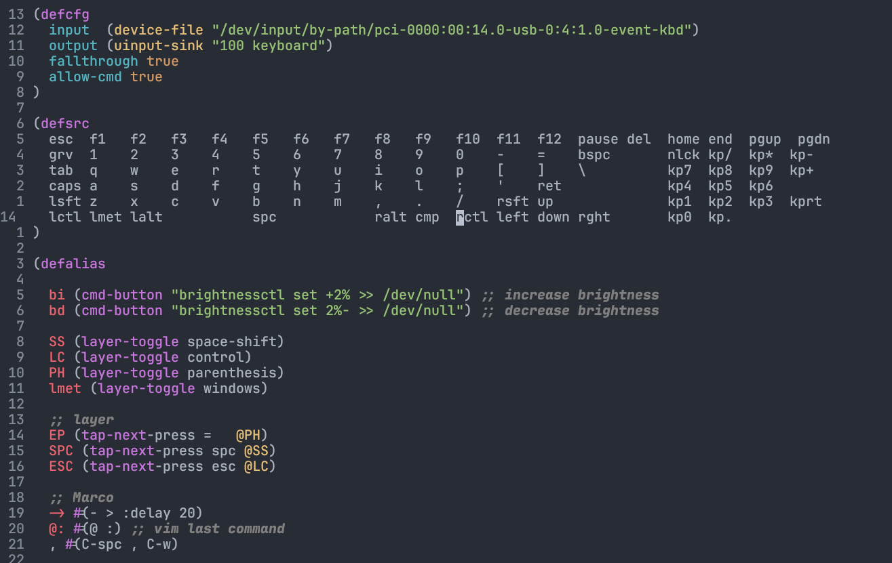
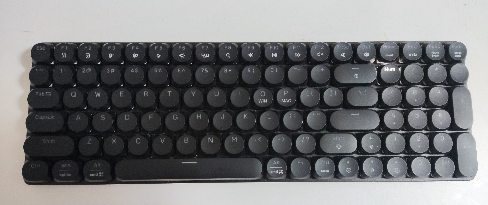

Kmonad repository on Github [https://github.com/kmonad/kmonad](https://github.com/kmonad/kmonad)

I find the default QWERTY keyboard layout have too much keys that require pinkys to type. Chances is very high that My pinkys will sucks first before I can become a hacker! If you don't like complible keyboard like me for whatever reason. Kmonad is likely to be the ultimate solution, Works on most platform, super protable, install Kmonad, copy keymaps file to new mahcine, finally get Kmonad run, and you have your own keymaps on any machine able to run kmoand. Moreover, Kmonad is one of the fews solution you can change your keyboard layouts on laptop.

Kmonad run on both Xory and Wayland on linux without any extra tweakings.

The only issue is ... I nearly unable to have natural typing experience on vanilla QWERTY keyboard. Merely a few keys change will have huge influence!

Though I have mentioned that Kmonad is crossplatform, I find Kmoand work the best on linux. You will end up ith some issue and require extra tweaks on MacOS and Windows.

 
snippets of kmoand files



# What can Kmonad do?
Kmonad is used to create [layer](https://blog.splitkb.com/introduction-to-qmk-features/) on top of your keyboard, you can think Kmonad is software implemention of QMK firmware. Similiar tools like Karabiner-Elements may not give the same levels of visualizing layer, Since Karabiner-Elements by default don't provide preview to the layer. While we define each keys' action in every layer when you writing Kmonad file. The code already talk you how the layer will be, saving time from memorize and debug. 

Nevertheless, if you merely swap a few keys, Kmoand may not be the best choice. Instead choose simpler tools like Karabiner-Elements or xinput will help you.

# Install Kmonad
You can either install its binary execute file, package(for Arch, Void, GNU Guix, NixOS only), or build it from source(work for most platform).

The official guide: [https://github.com/kmonad/kmonad/blob/master/doc/installation.md](https://github.com/kmonad/kmonad/blob/master/doc/installation.md)

## Build from source
Let's do this, Since Kmonad is written in Haskell, you will need Haskell project manager: [stack](https://github.com/commercialhaskell/stack) installed, it should be avalible via package manager on most of linux distro.

Clone kmoand repo and Build:
```sh
git clone https://github.com/kmonad/kmonad.git kmonad && cd kmonad && stack install
```
After build, Kmonad will be in `$PATH`.

Run `stack` to check if it is installed
```sh
kmoand
```

# Let's configure the keyboard layout!

## basic
Create kmonad config file
```sh
vim config.kbd
```
Kmonad file use lisp syntax style, The way to comment out code is use `;;`, note that it should be double semi-colon, since single `;` is literaly sending keycode of `;`. Block comments are start with `#|` and end with `|#`. For example:
```lisp
#|  This block is comment                                                              
(deflayer name-of-the-layer
  _   _   _   _   _   _   _   _   _   _   _   _   _   _     _  _ _  _  _ 
  _   _   _   _   _   _   _   _   _   _   _   _   _   _     _ _  _  _
  _   _   _   _   _   _   _   _   _   _   _   _   _   _     _  _  _  _
  _   _   _   _   _   _   _   _   _   _   _   _   _         _  _  _
  _   _   _   _   _   _   _   _   _   _   _   _ _           _  _  _  _
  _   _ _           _         _   _   _   _   _ _           _  _
)
|#
```
Every function will be in parenthesis `()` as usual in lisp-like language.

## Structure of Kmonad file
There are few block you will use.
1. (defcfg)
2. (defsrc)
3. (defalias)
4. (deflayer)

Overview:
- We configure at `defcfg` block
- We define the region you want to remap with kmonad at `defsrc`
- We alias at `defalias`, alias layer, marco... etc
- We define how layer works at `deflayer`

### defcfg
It contains some essential config information, like the source of input, where does output sink etc
```lisp
(defcfg
  input  (device-file "/dev/input/by-path/pci-0000:00:14.0-usb-0:4:1.0-event-kbd")
  output (uinput-sink "100 keyboard")
  fallthrough true
  allow-cmd true
)
```
```
fallthrough true
```
It is recommend turn it on, `fallthrough` make sure when events is out of deifne, the keycode will be sent literaly instead of ignored. It will save you from mistake when define layers. You still got those keys typed.
```
allow-cmd true
```
If you have some keymaps mapped to shell command, they will be run if you set `allow-cmd` to `true`. Otherwise, they will sipmly send to shell as [stdout](https://www.computerhope.com/jargon/s/stdout.htm).
```lisp
input  (device-file "/dev/input/by-path/pci-0000:00:14.0-usb-0:4:1.0-event-kbd")
```
Talk kmoand where is your original keyboard locate.
```lisp
output (uinput-sink "100 keyboard")
```
Talk kmoand how to handle the sent keycode so to make your defined layers work.

**Notes that output and input are different on Linux, MacOS, Windows**

```lisp
(defcfg
  input  (device-file "/dev/input/by-path/pci-0000:00:14.0-usb-0:4:1.0-event-kbd")
  output (uinput-sink "100 keyboard")
  fallthrough true
  allow-cmd true
)
```
official tutorial said that:
> In Linux we deal with input by performing an ioctl-grab on a specific
>   device-file. This allows us to hook KMonad on the input of exactly 1 keyboard,
>   and allows you to run multiple instances of KMonad for different keyboards. We
>   make an input using:
>     (device-file "/dev/input/by-id/my-keyboard-kbd")
> 
>   NOTE: Any valid path to a device-file will work, but it is recommended to use
>   the 'by-id' directory, since these names will not change if you replug the
>   device.
> 
>   We deal with output by creating a 'uinput' device. This requires that the
>   'uinput' kernel module is loaded. The easiest way to ensure this is by calling
>   'sudo modprobe uinput'. We create a uinput device using:
>     (uinput-sink "name" "optional post-init command")




```lisp
(defcfg
  input  (low-level-hook)
  output (send-event-sink)
  fallthrough true
  allow-cmd true
)
```
official tutorial said that:
> -- Windows ----
> 
> In Windows we do not get such fine-grained control. We use a low-level
> keyboard hook to intercept all non-injected keyboard events. There is
> currently an open issue to improve the C-bindings used to capture windows
> keyevents, and if you have a better way to approach this issue, help is deeply
> appreciated. You specify a windows input using:
> (low-level-hook)
> 
> Similarly, the output in Windows lacks the fine-grained control. We use the
> SendEvent API to emit key events directly to Windows. Since these are
> 'artificial' events we won't end up catching them again by the
> `low-level-hook`. It is very likely that KMonad does not play well with other
> programs that capture keyboard input like AHK. You specify windows output using:
> (send-event-sink)
> 
> Specific to Windows, KMonad also handles key auto-repeat.  Therefore your
> Windows system settings for key repeat delay and key repeat rate will have no
> effect when KMonad is running.  To set the repeat delay and rate from KMonad,
> pass the optional arguments pair to `send-event-sink`:
> (send-event-sink [ <delay> <rate> ])
> where:
> <delay> : how many ms before a key starts repeating
> <rate>  : how many ms between each repeat event
> A value of 500 ms delay and 30 ms rate should mimic the default Windows
> settings pretty well:
> (send-event-sink 500 30)




```lisp
(defcfg
  input  (iokit-name "my-keyboard-product-string")
  output (kext)
  fallthrough true
  allow-cmd true
)
```
official tutorial said that:
> -- Mac OS -----
> 
> For Mac questions I suggest filing an issue and tagging @thoelze1, he wrote
> the MacOS API. However, input using:
> (iokit-name "optional product string")
> 
> By default this should grab all keyboards, however if a product string is
> provided, KMonad will only capture those devices that match the provided
> product string. If you would like to provide a product string, you can run
> `make; ./list-keyboards` in c_src/mac to list the product strings of all
> connected keyboards.
> 
> You initialize output on MacOS using:
> (kext)



### defsrc
We will deifne the region in the keyboard you want to remap with kmond. The number of keys in defsrc can be less or more than the actual number on your keyboard. If you using a 60% keyboard, it is fine to use the template of 100% keyboard. Merely you will not able to trigger thsoe extra keys. Conversely, you can define 60% region of your 100% keyboard in `defsrc`. It should work unless you have defined worong keycode. The remaining keys will work as normal if you have set `fallthrough` true. If you got confused, let see some real example!
```lisp
(defsrc
  esc  f1   f2   f3   f4   f5   f6   f7   f8   f9   f10  f11  f12  pause del  home end  pgup  pgdn 
  grv  1    2    3    4    5    6    7    8    9    0    -    =    bspc       nlck kp/  kp*  kp-
  tab  q    w    e    r    t    y    u    i    o    p    [    ]    \          kp7  kp8  kp9  kp+
  caps a    s    d    f    g    h    j    k    l    ;    '    ret             kp4  kp5  kp6
  lsft z    x    c    v    b    n    m    ,    .    /    rsft up              kp1  kp2  kp3  kprt
  lctl lmet lalt           spc            ralt cmp  rctl left down rght       kp0  kp.
)
```
 
Here is my 100% keyboard:


Since lisp-like syntax is used, the indention can be ignore, they are only for readability. If you want, you can write them in single line.

If I don't want to remap numberpad, I can remove them from `defsrc`.
```lisp
(defsrc
  esc  f1   f2   f3   f4   f5   f6   f7   f8   f9   f10  f11  f12  pause del
  grv  1    2    3    4    5    6    7    8    9    0    -    =    bspc       
  tab  q    w    e    r    t    y    u    i    o    p    [    ]    \          
  caps a    s    d    f    g    h    j    k    l    ;    '    ret             
  lsft z    x    c    v    b    n    m    ,    .    /    rsft up              
  lctl lmet lalt           spc            ralt cmp  rctl left down rght       
)
```
The numberpad is cut. Nevertheless, `fallthrough` is set to be true, the nubmer pad still work perfectly. According to my experience, the order is not important, if they are in the same relative location in `deflayer`. You can imagine you are input the keys you would like kmonad to handle, so the order is not important. However, the following layer defining should follow the order you have defined here. Detailed explaiation in [here]().

Keycode is at maximum four chararcters long. Here is a short reference
```text
esc == escape key
grv == `

caps == caps lock
lctl == left control
lmet == left meta or left window keys on window.
lalt == left alt

spc == spacebar

cmp == fn on external keyboard
fn == fn on mac keyboard
wkup == fn on thinkpad built in keyboard

bspc == backspace
ret == return or enter

up == up arrow
left == left arrow
right == right arrow
down == down arrow

kp0 == 0 on numberpad
kp1 == 1 on numberpad
kp2 == 2 on numberpad
kp3 == 3 on numberpad
kp4 == 4 on numberpad
kp5 == 5 on numberpad
kp6 == 6 on numberpad
kp7 == 7 on numberpad
kp8 == 8 on numberpad
kp9 == 9 on numberpad
kp* == * on numberpad
kp+ == + on numberpad
kp- == - on numberpad
kp/ == / on numberpad
kprt == return or enter on numberpad
kp. == . or del on numberpad
nlck == number lock on keyboard(my keyboard have one single physical button for this function, I know some are done by combination keys)

ins == insert
del == delete
pgup == page up
pgdown == page down

sys == prtint screen on Thinkpad laptop built in keyboard
ssrq == print screen or PrtSc external keyboard

slck == scroll lock on external keyboard
pause == pause on external keyboard

102d == backslash on left on ISO keyboard

C-x == held down Control and x
A-x == held down Alt and x
S-x == held down shift and x
M-x == held down Meta and x
C-S-x == held down Control, shift and x
C-S-A-x == held down Control, shift, Alt and x
C-S-A-M-x == held down Control, shift, Alt, Meta and x
```
There is too many keymaps that impossible to list all of them here, you can check them on [kmonad provided templates](https://github.com/kmonad/kmonad/tree/master/keymap/template). Note that the keycode is case sensitive, `A` is equal to `S-a`.

### defalias
This part allow you make magic with kmoand!
Let's see an example:
```lisp
(defalias
  SS (layer-toggle space-shift) ;; alias layer space-shift to SS
  -> #(- > :delay 20) ;;keyboard macro, will simulate the key pressed with delay time 20 each.
  kp1 M-1

  layer1 (tap-next-press =   @SS) ;; tap as =, hold to active SS, same as layer space-shift

)
```
We can recall alias by adding prefix `@`, just like how you will define function in lisp, alias name followed by the command, macros, layer you want to alias. You can use defined alias in other alias. Alias is not necessary, but to avoid terrified readability, it is recommend to alias name to long buttons. You can put alias into single `defalias` block or separate them with multi `defalias`. Make sure you define alias properly beefor use somewhere else.

### deflayer
Here you will do the magic! The first `deflayer` will be the default layer, in other terms, the first layer when kmonad startup. To be convenient, usually named **base**.
```lisp
(deflayer base
  caps f1   f2   f3   f4   f5   f6   f7   f8   f9   f10  f11  f12  pause del  home end  pgup  pgdn 
  S-grv 1    2    3    4    5    6    7    8    9    0   \\    `  bspc       nlck kp/  @kp*  @kp-
  tab   q    w    e    r    t    y    u    i    o    p    S-'  [  ]          @kp7  @kp8  @kp9  @kp+
  @EP   a    s    d    f    g    h    j    k    l    ;    -    ret           @kp4  @kp5  @kp6
  @ESC  z    x    c    v    b    n    m    ,    .    /    rsft up            @kp1  @kp2  @kp3  @kprt
  lctl  lmet lalt           @SPC           @ALT cmp   rctl left down rght    @kp0  @kp.
)
```
There are fews points you should noted:
1. **` ( ) \ _** need to be escaped by `\`, as they have special meaning in kmonad.
2. Aliass can be called by `@`
3. `_` means transparent, you can leave unmapped key in layer with `_`, so that it will fallthrough to the last layer you enter. If it is the first layer, it will fallthrough to buttons define in `defsrc`.
4. The buttons define here will follow corresponding entry in the `defsrc`

The last one may seems to be difficult to understand.

#### Relation between defsrc and deflayer
If I only want to play with only three keys on my keyboard. I will define them in `defsrc` like so:
```lisp
(defsrc
  q w e
)
```
Kmonad will then only care that three keys on your keyboard, that is `q`, `w`, and `e`, the first three buttons on top row on normal QWERTY keyboard. I want them to be ctrl-c, ctrl-v, and ctrl-a respectively. Then I will define them like so in `deflayer`:
```lisp
(deflayer base
  C-c C-v C-a
)
```
Do you remember I have mentioned that the order is not important? It is partial correct. If you have swap the order of key. For exampe I swap q and e in `defsrc`:
```lisp
(defsrc
  e w q
)
```
Note that kmonad will still able to locate this three keys on keyboard, but the order in `deflayer` has to be changed as well in order to have same mapping as above:
```lisp
(deflayer base
  C-a C-v C-c
)
```
Otherwise if you keep doing this:
```lisp
(deflayer base
  C-c C-v C-a
)
```
`e` will mapped to `C-c`, `q` will mappped to `C-a`. Everything will not go as you expected. Therefore, I would recommend you define buttons in `defsrc` as how your keyboard look like. Define buttons in `deflayer` will get a lot easier.

## Start building your own keyboard layer
There is some useful implemention that is useful to add to your keyboard, they are:
1. layer, or in other terms: modifier key, when you hold down some keys, different layer will be active.
2. leader-key, or some will call it dead key, unlike modifier keys require holding manys keys at a time, leader-key usually use key sequence, type one by one.
3. tap-mod, give double purpose to single keys, tap it and hold it will trigger two different event
4. tap-dance, give single different purpose depends on amount of time pressed.
5. magic keys, usually refer to single key act like 4 modifier hold together(shift+meta+ctrl+alt) when holding 

For convenience, I would like to define a small keyboard for demostration:
```lisp
(defsrc
  q w e r t y
)
```
The example below will base on this little keyboard.

### Model of Kmonad
Kmonad model layer as [stack](https://en.wikipedia.org/wiki/Stack_(abstract_data_type)), it will always try to match input event to the top most layer. Still remember the first layer is the default layer, because it is the only layer that addedd to stack when kmonad startup. Noted that incorrect layer push and pop can break your keyboard. It is better to have two keyboard when you config Kmonad, so that you are still able to repair after accidently broke the keyboard.

### How to write the first layer
Here is an example function, you don't need to know what it is now.
```
(sticky-key <timeout> <event>)
```
Timeout is counted in `ms` within kmonad, every timeout you see later is also counted in `ms`. You can alias name to this function like so:
```lisp
(defalias
  sctl (sticky-key 500 lctl) ;; although alias is recommended no longer than 3 words
)

(deflayer base
  @sctl w e r t y
)
```
This is good demo how you can use alias in layer. It is equivalent to:
```
(deflayer base
  (sticky-key 500 lctl) w e r t y
)
```

To define a layer:
```lisp
(defalias
  l1 (layer-toggle my-first-layer) ;; layer is pushed when active, pop when inactive, just means to be "toggle"
  tri (tap-next w @l1) ;; tap as w, hold as @l1, which will active my-first-layer
)

(deflayer base
  q @tri e r t y
)

(deflayer my-first-layer
  _ _ a _ b
)
```
So, when you tap `w`, it will emit `w`, when you hold `w`, my-first-layer will active, if you press `e` now, it will become `a`, if you press `q` now, it will emit `q`, as `q` is transparent in `my-first-layer`, KMonad will try to match this key event in the next layer(layer under my-first-layer in stack) until matched. In our case which is `q` in layer `base`. 

Again, if don't use any alias:
```lisp
(deflayer base
  q (tap-next w (layer-toggle my-first-layer)) e r t y
)

(deflayer my-first-layer
  _ _ a _ b
)
```

Layer can be neste in layers, for example layer2 can be actived when you press some keys in `my-first-layer`. KMonad syntax is simple, the magic comes from the combination of different function and alias. Below is explaiation of KMonad functions.

### Difference between tap and holding
Tap idealy is press and release instantly without delay. In KMonad, which accept if key is released within some threshold value will be triggered as **Tap**. Otherwise, it is holding.

### KMonad functions
KMonad will run the function when it is being active. How? when you press the keys, the function will be active if it has been defined in the `deflayer` block. Moreover, function call be called by other function. For example:
```lisp
(defalias
  b1 (f1 (f2 (f3 (f4 arg))))
)
(deflayer base
  @b1 w e r t y
)
```
Q is mapped to the function f1, which will call function f2, which will call .... f4

Note that the fucntion will only interact with your keyboard, they will not interact with other function, no value will be return. There is no variable assign. It is configuration, not scripting.

#### sticky-key
```lisp
(defalias
  bt1 (sticky-key <timeout> <event>)
)
```
sticky-key allow you tap two keys consequencely instead of holding two keys at the same time. **event** should be a modifier.

Example:
```
(deflayer base
  @bt1 w e r t y
)
```

How it works:
```text
tap q tap wer -> Wer
```

#### around
```lisp
(defalias
  bt1 (around <button1> <button2>)
)
```

Simulate holding **button1** and **button2**. `(around lctl c)` is equal to `C-c`. You can create nested `around`, like `(around lctl (around lsft c))`, which is equivalent to `C-S-c`

#### around-next
Very simliar to `sticky-key`, **event** can be layer which is not limited in modifier keys( actually I haven't test it, it is not stated clearly in offical tutorial.)
```lisp
(around-next lsft) ;; shift the next key pressed
(around @my-first-layer) ;; next press in my-first-layer
```

#### around-next-timeout
Similiar to `around-next` but added timeout, if not following key is pressed within timeout, the last key will be insert (of course it is not limited to key, you can bind it to any event that is valid).
```lisp
(around-next-timeout 500 sft q) ;; shift the next key if pressed within 500ms, otherwise q is inserted
```

#### tap-macro
record key sequence marco, simulate as those keys is pressed. You can either use `tap-macro` function or shorten as `#()`
```lisp
(tap-macro K M o n a d)
#(K M o n a d)
```
marco can be used in other macro like so@:
```lisp
(defalias
  m1 (tap-macro K M o n a d)
  m2 #(K M o n a d)
  m3 #(@m1 @m2 t h r e e C-c C-v C-a)
)
```
Since sometimes the delay between keys matter, you can use `:delay` to separate each key.
```
#(K M o n a d :delay 10) ;; same as K 100ms M 100ms ....
```

#### tap-macro-release
similar to tap-macro but the last key is delay sometimes by default
```lisp
(tap-macro-release q w e) ;; same as q w delay e
```

#### pause
```lisp
(pause <time>)
P<time> ;; shortcode, for example P5 is same as (pause 5)
```
Pause **time** ms, useful to work with macro to have non-uniform delay
```lisp
#(K P5 M P100 m P10000 o n P500 d)
#(K (pause 5) M (pause 100) m (pause 10000) o n (pause 500) d) ;; they are equivalent
```

#### layer-toggle
It is the first function that is related to layer manipulaiton. Add the layer to the stack when active, remove from stack when inactive. The layer is temporary live when you trigger it, we ususally bind it to keys.
```lisp
(defalias
  b1 (layer-toggle layer1)
)

(deflayer base
  @b1 w e r t y
)

(deflayer layer1
  _ C-c C-v S-s _ _
)
```
`layer-toggle` will be remove from stack when inactive, in other to switch to layer1, I have to hold `q`( the button mapped to layer, remember [the little keyboard define above]()? ).
```
hold q tap w -> C-c
hold q tap r -> S
hold q tap t -> t
```

#### layer-delay
```lisp
(layer-delay <timeout> layer-name)
(layer-delay 500 layer2) ;; example
```
`layer-delay` is similiar to `around-next-timeout`. The difference are `layer-delay` will add the layer to stack and remove after **timeout**

#### layer-next
```lisp
(layer-next layer-name)
```
like `layer-delay` without **timeout** limit but the layer will be removed from stack once a key is pressed.

But note that from offical tutorial:
> `layer-next`, once pressed, primes KMonad to handle the next press from some
>  arbitrary layer. This aims to fill the same usecase as `layer-delay`: the
>  beginnings of 'leader-key' style behavior. I think this whole button will get
>  deleted soon, because the more general `around-next` now exists (see below)
>  and this is nothing more than:
> 
>    (around-next (layer-toggle layer-name))
>
>  Until then though, use `layer-next` like this:
>
>    (layer-next layer-name)

#### layer-switch
The above three layer is almost save since the layer is changed temporarily, start from now on, everything become "dangerous". The layer will be changed permanently.
```lisp
(layer-switch layer-name)
(layer-switch colemak) ;;example
```
Note that `layer-switch` will remove the **bottom-most** layer, which is the **default** layer. Make sure you have way to get back **default** layer. Otherwise, your keyboard can be broken.
```lisp
(defalias
  col (layer-switch colemak)
  qwe (layer-switch qwerty)
)

(deflayer qwerty ;; the name of default layer is arbitrary
  q w e r t @col ;; when I tap y, layout is switched from QWERTY to Colemak
)

(deflayer colemak
  c o l e m @qwe ;; when I tap y, layout is switched from Colemak to QWERTY
)
```

#### layer-add
```lisp
(layer-add layer-name)
```
Push layer to stack( add to the top ).

#### layer-rem
```lisp
(layer-rem layer-name)
```
Remove layer from stack by name. Note it is not [pop](https://en.wikipedia.org/wiki/Stack_(abstract_data_type)). The specified layer will be remove directly.

#### tap-next
Function about layer is ended, following function aims to give keys mulit purpose when it is being tapped or held.
```lisp
(tap-next <tap> <hold>)
(tap-next q lsft)
```
The **tap** and **hold** can replaced by alias, like `layer-toggle` or `tap-macro`. They accept either keycode, function or alias.
```lisp
(defalias
  layer1 (layer-toggle layer1)
  tm1 (tap-next q @layer1) ;; the alias used here is not the one define in deflayer block. Instead the above line's one.
  tm2 (tap-next w lsft)
)

(deflayer base
  @tm1 @tm2 e r t y
)

(deflayer layer1
  _ C-c C-v S-s _ _
)
```
```
press q relase q                   -> insert q
press w tap erty release w         -> insert ERTY
press w press e relase w release e -> insert EEEEEEEEeeeeeeeee..... 
```
If any event is involved with the gap between press and release, **hold** event is triggered. Otherwise, **tap** event is triggered. If `tap-next` is released before any holding keys, `tap-next` will also fallback to **tap** event.

#### tap-hold
```lisp
(tap-hold <timeout> <tap> <hold>)
```
`tap-hold` is similar to `tap-next`, the difference lay in `tap-hold` will pause untill KMonad determine should it be **tap** or **hold**. `tap-hold` will trigger **tap** if it is released within **timeout**, no matter how much key you pressed during timeout.
```lisp
(defalias
  tm2 (tap-hold 1000 w lsft)
)

(deflayer base
  q @tm2 e r t y
)
```
```
press w
press e for 900ms
release w
insert: eeeeeeeeeeeee....
```
Since w(`tap-hold`) is relase before timeout end.

#### tap-hold-next
```lisp
(tap-hold-next <timeout> <tap> <hold> :timeout-button x)
;; :timeout-button is optional, by default it is the hold event
```
Combination of `tap-hold` and `tap-next`. When holding `tap-hold-next` button longer than **timeout**, it will become **hold** event or you can specify the button after timeout. If the key is susposed to be held like `ret`, many newline will be inserted(so call autorepeat).

#### tap-next-release
Just like tap-next, but **hold** event will only trigger if other keys is tap(press and relase) before `tap-next-release` relase. If you relase other keys before `tap-next-release` release, `tap-next-release` will trigger **tap** event. See the example below.
```lisp
(tap-next-release <tap> <hold>)
```
```lisp
(defalias
  tm2 (tap-next-release w lsft)
)

(deflayer base
  q @tm2 e r t y
)
```
```
press w press e relase w release e -> insert we
press w press e relase e release w -> insert E
```

#### tap-next-press
```lisp
(tap-next-press <tap> <hold>)
```
Just like `tap-next-release` but it will always be **hold** event if you have press other keys after pressing `tap-next-press`. Using the same example as [tap-next-release](#tap-next-release) but using `tap-next-press` this time.
```
press w press e relase w release e -> insert E
press w press e relase e release w -> insert E
```

#### tap-hold-next-release
```lisp
(tap-hold-next-release <timeout> <tap> <hold> :timeout-button x)
;; :timeout-button is optional, by default it is the hold event
```
Just like [tap-next-release](#tap-next-release), but turn into **hold** event after holding longer than **timeout** like [tap-hold-next](#tap-hold-next).

#### multi-tap
```lisp
(multi-tap <timeout <1> <timeout> <2> <timeout> <3> <timeout> <4> .... <timeout> <n-1> <n>)
(multi-tap 300 a 300 b 300 c 300 d e)
```
Trigger different base numbers of time you tap. Just like combo in fighting game. If you want the combo numbers increaes, you have to continue within some time. In `multi-tap` you have to release that key before the **timeout**.

#### cmd-button
If you have set `allow-cmd` true in [defcfg](#defcfg), you can map button to run shell command.
```lisp
(cmd-button "brightnessctl set +2% >> /dev/null") ;; increase brightness
```
Note that the command should be paired by quote.

### How to choose the fucntion
There is six `tap-xxx` function that is similar, don't know which one should you pick? Actucally, the difference between them may are not that obvious when you typing. For exampe, the pairs [tap-next-release](#tap-next-release) and [tap-next-press](#tap-next-press). I have only occur the difference when I type to fast. Sometime when I type too fast, I will accidently release the key in wrong order so that the **hold** event is not triggered. However, I do agree some is more powerful. Like [tap-hold-next-release](#tap-hold-next-release) and [tap-hold-next](#tap-hold-next) are way more comfortable. Because most of the time, when one use `tap-mod` dual function key, you won't want it to fallback to **tap** after holding for some becuase can't decide which key you use. For exmaple
```lisp
(tap-next-release spc lsft) ;; tap as spacebar hold as shift
```
You hold the spacebar, want to insert `I`, but find that actually you should insert `i`, but since you using `tap-next-release`, when you relase spacebar, a space is inserted, you have to press backspace. However if you use `tap-hold-next-release`, this issue will not even happen.
```lisp
(tap-hold-next-release 250 spc lsft)
;; tap as spacebar hold as shift, after hold 250ms become shift
```
Same situation, but this time when you release spacebar, it will insert left shift instead, actually nothing inserted. But I should not stop other using the same pattern as me, as one may accidently find the function fix their need perfectly. You can try different function, and decide which one to use. Make a change is just so easy, change the config file, run kmonad, that is. ( a lot easier that recomplie QMK firmware, though KMonad is less feature and powerful as QMK)

Although `tap-hold-next-release` and `tap-hold-next` is "better" than `tap-next-press` as they will not trigger **tap** event after holding some time, but if I type too fast, I foudn sometimes space is eaten. So I personaly prefer `tap-next-press` more than any other function.

# run on startup
After finishing the config file, we can move to the final step. Run KMonad on startup, here provide example I use, which use [systemd service](https://en.wikipedia.org/wiki/Systemd)

create `/usr/lib/systemd/system/kmonad.service`
```
sudo -e /usr/lib/systemd/system/kmonad.service
```
add below lines into the last created `/usr/lib/systemd/system/kmonad.service`

```service
[Unit]
Description=kmonad keyboard config

[Service]
Restart=always
RestartSec=3
ExecStart=/path/to/kmonad /path/to/config.kbd
Nice=-20

[Install]
WantedBy=default.target
```
Find path to kmonad by 
```sh
which kmonad
```
Enable the service
```sh
sudo systemctl daemon-reload
sudo systemctl start kmonad.service # start the service
sudo systemctl enable kmonad.service # run service at startup
```

# Some example implemention
Here are some partial example of how to turn discrete functions into something useful. The example below will using the six key little keyboard (qwerty)
```
(defcfg
  input (...)
  output ...
  fallthrough true
  allow-cmd true
)
(defsrc
  q w e r t y 
)
```

## leader-key
If you use vim, you may have some mappings like `nmap <leader>we <Cmd>W | e!<Cr>`. Leader key is keyboard shortcut that is triggered by input keys sequence instead of holding many buttons at the same time. Use `<leader>we` as an example, we should first choose a key to be leader-key. In may little keyboard, I choose `q`, so `<leader>we` is basically `qwe`. Here is how to implement it in KMonad.
```lisp
(defalias
  ld (layer-next leader-triggered)
  mid (layer-next key-after-leader-q)
  out #(K M o n a d) ;; this is what <leader>we will do
)

(deflayer base
  @ld w e r t y ;; leader is q
)

(deflayer leader-triggered ;; active when we enter q
  _ @mid _ _ _ _
)

(deflayer key-after-leader-q ;; active when we enter qw
  _ _ @out _ _ _ ;; @out will trigger when we finish qwe
)
```
leader-key is definitly define serveral layer, enter next layer by using the correct "key"

## tap-mod
The example will use `tap-next-press`, becuase I personally prefer this over others.
```lisp
(defalias
  cv (layer-toggle cv-engineering)
  tm (tap-next-press q @cv)
)
(deflayer base
  @tm w e r t y
)

(deflayer cv-engineering
  _ C-c C-v C-a C-t C-x
)
```
This is, you can think layer-toggle as a **hold** event( actually it is, it actives only when key bind to is held ). When I tap `q`, it insert `q`, when I holding `q`, Keyboard enter layer `cv-engineering` which allow me easy copy and paste.

## tap-dance
I want `q` become `q` when it is tap once, `C-c` when tap twic, `C-v` when tap triple.
```lisp
(defalias
  qcv (multi-tap 500 q 500 C-c 500 C-v)
)

(deflayer base
  @qcv w e r t y
)
```

## Generate transparent layer for easier configuraiton
As you won't want to manually create fallthrough case for each keys. Normally, we make changes on transparent layer which is a template layer that replace all buttons in `defsrc` by `_`. See the real world example below:
```lisp
(deflayer windows
  _   _   _   _   _   _   _   _   _   _   _   _   _   _     _  _  _  _  _ 
  _   _   _   _   _   _   _   _   _   _   _   _   _   _     _  _  _  _
  _   _   _   _   _   _   _   _   _   _   _   _   _   _     _  _  _  _
  _ _   _   _   _   _   _   _   _   _   _ _ _         _  _  _
  @switch   _   _   _   _   _   _   _   _  _   _   _ _           _  _  _  _
  _   _ _           _         _   _   _   _   _ _           _  _
)
```
which is come from the transparent layer
```lisp
#|                                                               
(deflayer name-of-the-layer
  _   _   _   _   _   _   _   _   _   _   _   _   _   _     _  _ _  _  _ 
  _   _   _   _   _   _   _   _   _   _   _   _   _   _     _ _  _  _
  _   _   _   _   _   _   _   _   _   _   _   _   _   _     _  _  _  _
  _   _   _   _   _   _   _   _   _   _   _   _   _         _  _  _
  _   _   _   _   _   _   _   _   _   _   _   _ _           _  _  _  _
  _   _ _           _         _   _   _   _   _ _           _  _
)
|#
```
Here is a quick hack to generate transparent layer with vim ex command
1. select the buttons inside `defsrc`
2. run the ex command 's/\v\S+/_/g'

KMonad contains infinite possible, it is only limited by our creativity, start building your keyboard layout now.
