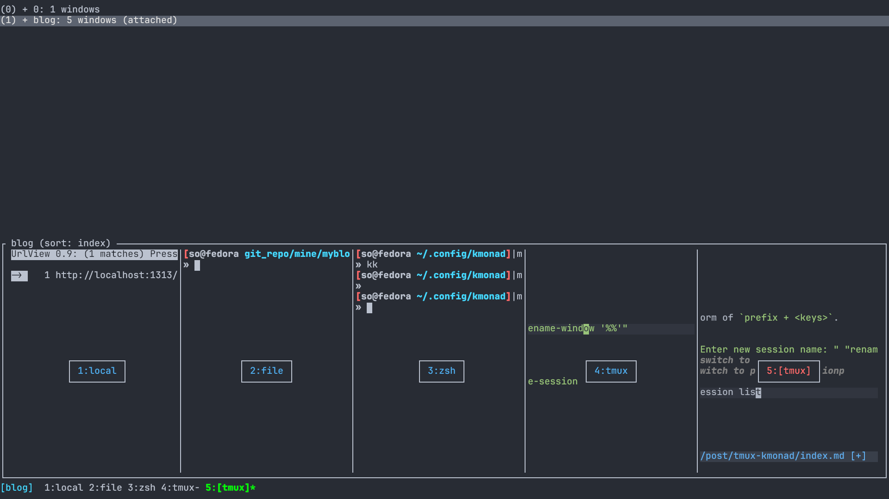

If you have use tmux, you know it come with a bad key bindings. Force you to spend time config Tmux. Here are how I use tmux with kmonad to save the sucked default key bindings.

# Tmux
Since tmux have session, window, and pane. Like navigate windows and pane must be often than session, we will prefer less key to navigate windows and pane than session

Therefore shortcut related to window will in form of `M-*`(for example alt-a), shortcut related to session will in form of `prefix + <keys>`

## change tmux prefix
Tmux default prefix suck. `Ctrl-b` are far from each other, if everytim we run tmux command have to press `Ctrl-b`, I just suffer. So, I change it to `ctrl-space` instead.
```sh
unbind C-b
set -g prefix C-space 
bind C-space send-prefix 
```

## Session
Session shortcut will in form of `prefix + <keys>`.
```sh
bind n new-session -t
bind r command-prompt -p "Enter new session name: " "rename-session '%%'"
bind j switch-client -n # switch to next session
bind k switch-client - # switch to previous sessionp
```
`prefix+s` will show the session list


## Window
Since windows shortcut are more handy than session's
Bind single key without prefix will be easier for day to day usage
```sh
bind -n M-o new-window # open new window at home directory $HOME
bind -n M-enter new-window -c "#{pane_current_path}" # open window at the same directory as current pane
bind -n M-r command-prompt -p "Enter new window name: " "rename-window '%%'"
bind -r -n M-h select-window -t :- # previous window
bind -r -n M-l select-window -t :+ # next window

unbind '"'
unbind %
bind - splitw -v -c '#{pane_current_path}' # horizontal split 
bind | splitw -h -c '#{pane_current_path}' # vertical split
```

## Pane
Similar to window, but since my main machine is a thinkpad, the screen is so small, I use pane less, if you have a big screen, you may swap some shortcut between window's and pane's
```sh
bind -n M-x kill-pane
bind -n M-m select-pane -t :.+ # pane cycling
bind -n M-f select-pane -t :.+ # pane cycline 
bind -r H resize-pane -L 5
bind -r L resize-pane -R 5 
bind -r K resize-pane -U 5  
bind -r J resize-pane -D 5
```
The first line will kill pane instantly, if there is single pane, kill window instead, if there is single windwo and single pane, kill session instead.

If you wonder how to resolve shortcut conflict with other terminal application require modifier `alt`, I will try my best to avoid them, leaving all shortcut with `alt` for tmux, and `ctrl` for other application. BTW, if you use vim, you will have less chance to use modifier `alt`, therefore using vi-mode in shell can reduce the relay of `alt` when line editing.
