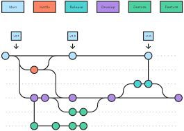

This blog is written for those how nothing about git. Just a quick start about what you can do with your command line tools [git](https://git-scm.com/). 

# What is git

This picture describe what is git, imagine your working direction of your project, when you want to try something new and don't want to break and manually merge new feature to your development, create a branch, like parallel universe, you can take another try in parallel universe, after that, you can merge those branch to your **main** branch or simply delete the branch. ***"Branch is cheap"***.

# basic usage
convert current directory into git repo, all subdirectory will be managed by git
```sh
git init 
```

You can check which file is being changed
```sh
git status
```

We say the chagne is state when you commit it, before commit, you have to add the change to git.
```sh
git add <file1> <directory1> <directory2> # add changed directory and file to git index

git commit -m "commit message for this change "
```
Usually the commit will not longer than 50 words as to summarize the change you have make, if you have additonal information about this change, you can add notes to commit
```sh
git notes add <commit>
```
To have a overview of commit, you can check git log
```sh
git log <commit>
```

Once you commit the change, the branch add a node, like check point of game, you can reset the change by reset the commit.
```sh
git reset <commit index> # reset the commit and unstate the change, working directory leave unchanged 
```
Use option `--hard` to apply revert the directory also
```sh
git reset --hard <commit index> # reset the commit and unstate the change, working directory change back to the state of that commit
```
**Be careful the change between HEAD and the commit going to revert by `git reset` will be lost, extremely careful to use with the flag `--hard`**

Create new branch to test new feature. This branch's working directory will same as the last state of current branch.
```sh
git branch <feature1> # create new branch
```
Then main branch is called **main**. You can switch branch if there is not change unstated, otherwise, you have to commit the change first.
```sh
git switch <branch name> # git branch name
```
You can merge branch to other branch. You need to first checkout the branch you want to merge to.
```sh
git checkout <branch merge to>
```
Then you can merge two branches
```sh
git merge <branch going to be merged>
```

Above git command is enough for version control your config, to get with git, it is best to try it, use it. If you afraid your config break, backup it before version control.

# Usage
Neovim community often post some config that is fully configured in lua instead of vimscript, however, you have to make a lot of change, if you want to keep vimscript config separately, try to create a branch call **"lua"** and you don't have to merge this branch if unnecessary.

I want to try an plugins call [obsidian.nvim](https://github.com/epwalsh/obsidian.nvim), which use [nvim-cmp](https://github.com/hrsh7th/nvim-cmp) as completion frontend, I use [coc.nvim](https://github.com/neoclide/coc.nvim) at that time, so I try to use **nvim-cmp**, you can find more in [this blog](../vim-4)

If you want to try new plugins without breaking your current config, you can create a branch call **experiment**, before apply change to **main**, test it in **experiment** branch first, later you can merge the change to from **experiment** to **main**. The benefits of this approach is that if you don't want to fix the problem of new plugins now, you can still fallback to your stable, working config, fix the issue when you have free.
