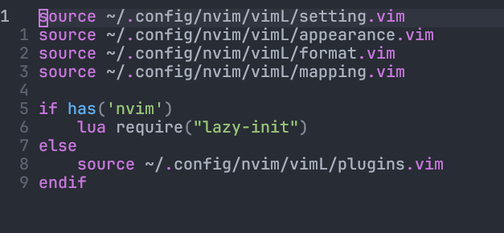
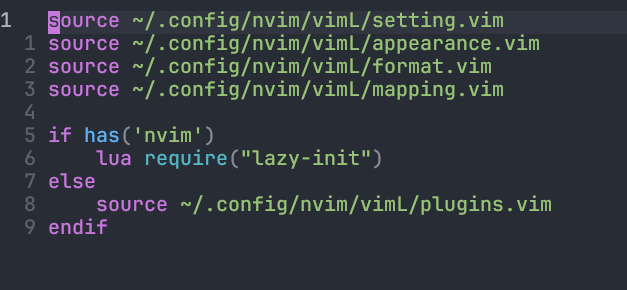

Neovim in 2023 has become an popular choice of editor, its version become stable those day. Neovim to Vim is like Vim to Vi those day, it has introduced a clear lua API for writing plugins, built-in LSP support. Although some plugins like [coc.nvim](https://github.com/neoclide/coc.nvim) has provide feature like LSP and auto-completion similar as VSCode, the built-in LSP support just give the sense of it will last longer and improved by a larger community as it is built-in. Also, more lua plugins has come out, which sadly only support Neovim, as they need Neovim API.

# Vim
Back to the day I launch Vim first time, Vim have already give me different feel from modern editor, its default color scheme, its "non-beginner friendly" default setting force me to google solution many times. After use Vim for sometimes, I have known Neovim, a forked version of Vim, fully compatible with vimscirpt plugins, a modern version of Vim, and extended in different language lua, At the beginning, I don't want to make a switch, current state of Vim was already make me satisfed. The introduction of Vim9script excited me a lot, I wrote vimscirpt before lua, in my opinion, vimscirpt as a Domain Specify Language, it is less verbose than lua. Also, I don't write big plugins, lua API don't attact me much. But the performance of Vim9script has been improved a lot compare to lengency vimscirpt. I still want to stay with Vim. However I discover quite many vimers I have followed on online has switch to Neovim, it is the first time I have consider seriously about making a switch. I can't found myself a good reason not to change other than it may waste my time. Since I use Vim first, the plugins I relay on are still pure vimscirpt plugins, making switching no benefits. I told myself, if there is a must have plugins that is specified to Neovim, I should make a switch.

# Neovim
The plugin I switch for is [nvim-treesitter](https://github.com/nvim-treesitter/nvim-treesitter). Treesitter provide correct highlight by understanding your code structure. Recently Vim/Neovim highlihgt is base on regular expression, which may not cover all the case, therefore render syntax highlight wrong,

My `init.vim` without Treesitter:


My `init.vim` with Treesitter:


Correct highlight is one of feature treesitter can provide, other feature like indention, selection increment/decrement are also supported. If the language you are using have treesitter parse, you can enjoy those features. The abstruct syntax tree where treesitter powered from, is also a good source for writing a plugin, extend you text object to function, class, object, or declaration. Of course regular expression can do so, it just can't make sure 100% correct and need to build rule for matching. I know emacs also integrate Treesitter in Emacs29. I believe plugins that can understand the code will keep exploring more surprise usage, introducting more useful features in the future. Therefor I make switch.

The switching actually don't cost anytime, I spend minutes finding the color scheem support treesitter. Installing them using the plugins manager I used in vim, everything just work.

# Why Neovim
Simply becuase you will have a greater community, both vim and neovim community, merely missing compatible with Vim9script. You can enjoy plugins from Vim and Neovim. This reason is strong enough for one who have struggling between Neovim and Vim. The number of plugins that is written in Vim9script are handfully small.

# Neovim from Vim
Before using Neovim, I use `:sh` often. However, this command was dropped in Neovim, I don't understand why this is dropped. Nevertheless, I change my habit, even better practice after change. I use new tmux window instead of `:sh` to recall the shell Neovim from. If I really want to copy some content from the shell opened Neovim, I can use `Ctrl-Z` to suspend Neovim and use `fg` continue Neovim process.

I agree some discussion about switching or not, some people hold that there is no features they need in Neovim. That maybe true, but how about plugin ecosystem, it seems more powerful plugins come out, you may want one of them in the future. Switch early so that suffer less in the future. Switch won't consume too much time if you going to keep you configuration in vimscirpt, if necessary to use lua, you can use `lua` in you `*.vim` file.
```vim
lua require("<name of lua moduale>")
```

Switching to Neovim from Vim are simple because you are still using *"the same"* editor, the configuration, the way how vim handle text editor, the way to extend is similiar. Unlike switching to other types of editor like Emacs, which definitly have different *"Emacs way"* you need to adapt.


