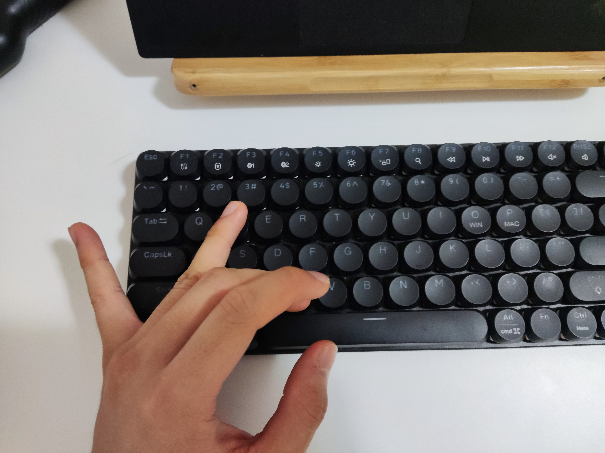
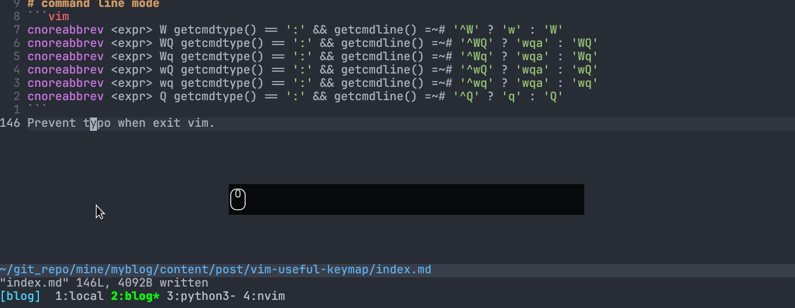

# Highlight search with n, N, *, #, /, ?
Highlight search, highlight search contain, clear when buffer has occur any change, or enter insert mode
```vim
nnoremap / :set hlsearch<cr>/
nnoremap ? :set hlsearch<cr>?
nnoremap * :set hlsearch<cr>*
nnoremap # :set hlsearch<cr>#
vnoremap * y/<c-r>0<cr>:set hlsearch<cr>
vnoremap # y?<c-r>0<cr>:set hlsearch<cr>

nnoremap <expr> n (v:searchforward ? 'n:set hlsearch<cr>' : 'N:set hlsearch<cr>')
nnoremap <expr> N (v:searchforward ? 'N:set hlsearch<cr>' : 'n:set hlsearch<cr>')
```
The original N/n direction depends one you use `#`/`*` or `/`/`?`, sometimes really confuse me. So I would like to make n/N always in one direction

```vim
nnoremap <c-w>/ :set hlsearch<cr><c-w>v<c-w>l/
nnoremap <c-w>? :set hlsearch<cr><c-w>v<c-w>l?
nnoremap <c-w>* :set hlsearch<cr><c-w>v<c-w>l*
nnoremap <c-w># :set hlsearch<cr><c-w>v<c-w>l#
```
search in split window, useful when I want to compare paraggraph that longer than my laptop height.

```vim
xnoremap <leader>p "_dP
```
Paste without pollute register from [ThePrimegen](https://www.youtube.com/watch?v=qZO9A5F6BZs&t=360s)

# System clipboard paste and seletion
```vim
" copy and paste
if has("linux")
    nnoremap <leader>y "+y
    nnoremap <leader>Y "+Y
    vnoremap Y "+y
    vnoremap X "+x
    vnoremap <C-c> "+y
    nnoremap <leader>P "+p
    vnoremap <leader>P "+p
    inoremap <C-v> <C-r><C-o>+
    "inoremap <C-v> <C-o>"+p
    cnoremap <C-v> <C-r><C-o>+
    nnoremap gy :1,$y +<cr>
else
    nnoremap <leader>y "*y
    nnoremap <leader>Y "*Y
    vnoremap Y "*y
    vnoremap X "*x
    vnoremap <C-c> "*y
    nnoremap <leader>P "*p
    vnoremap <leader>P "*p
    inoremap <C-v> <C-r><C-o>*
    cnoremap <C-v> <C-r><C-o>*
    nnoremap gy :1,$y *<cr>
endif
```
`nnoremap <leader>y "+y` prepare for copy text object to system clipboard. To copy current line, either `VY` or `<leader>yy`. Also I map `<C-c>` and `<C-v>` for copy and paste, vim copy and paste are good, but I just can't escape copy and paste with Ctrl C and Ctrl V. `gy` will copy whole file into system clipboard.

# Vertical Motion
keep the direction same as `j` and `k`
```vim
noremap ( )
noremap ) (
```

keep the direction same as `j` and `k`
quick 5 line jump
```vim
noremap J 5j
noremap K 5k
```

# Horizontal Motion
```vim
noremap <leader>h ^
noremap <leader>l $
```
I can't blind type `^`, if `^` is mapped, I think there is no reason to leave `$` alone.

# text object
```vim
onoremap l w
onoremap h iw
onoremap L W
onoremap H iW
```

 
It is how I type `cw`


# Indention
keep selection when increase/decrease indention.
```vim
vnoremap < <gv
vnoremap > >gv
```

Format the whole file, `''` will back to the last jump
```vim
nnoremap =<leader> gg=G'' 
```

# buffer
```vim
nnoremap <Bs> :bn<cr> 
nnoremap <C-H> :bp<cr> 
nnoremap <leader><bs> :b#<cr> 
nnoremap <CR> :ls<cr>
" keep <cr> function in cli window and quickfix
autocmd CmdwinEnter * nnoremap <CR> <CR>
autocmd BufReadPost quickfix nnoremap <CR> <CR>
```
I rarely open lot of buffers, cycling is enough, `<C-H>` is equivalent to `<C-backspace>`

# command line mode
```vim
cnoreabbrev <expr> W getcmdtype() == ':' && getcmdline() =~# '^W' ? 'w' : 'W'
cnoreabbrev <expr> WQ getcmdtype() == ':' && getcmdline() =~# '^WQ' ? 'wqa' : 'WQ'
cnoreabbrev <expr> Wq getcmdtype() == ':' && getcmdline() =~# '^Wq' ? 'wqa' : 'Wq'
cnoreabbrev <expr> wQ getcmdtype() == ':' && getcmdline() =~# '^wQ' ? 'wqa' : 'wQ'
cnoreabbrev <expr> wq getcmdtype() == ':' && getcmdline() =~# '^wq' ? 'wqa' : 'wq'
cnoreabbrev <expr> Q getcmdtype() == ':' && getcmdline() =~# '^Q' ? 'q' : 'Q'
```
Prevent typo when exit vim.

