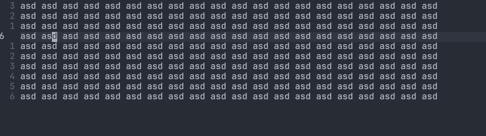
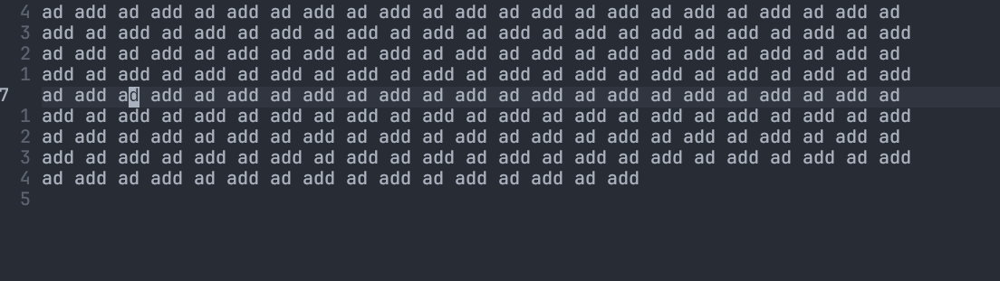
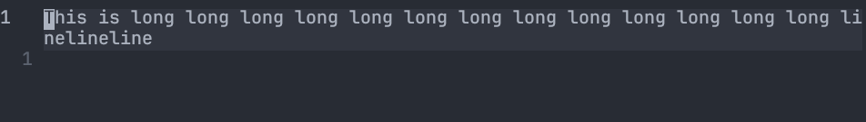
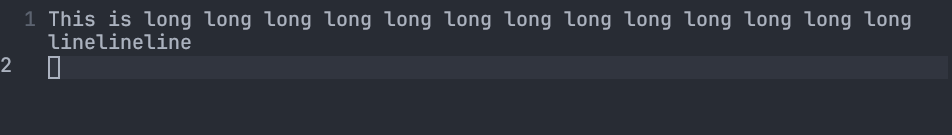

Some setting you may google for it after you have started using vim. Add those line to you `.vimrc`

If you use Neovim, it by default has some [better setting](https://neovim.io/doc/user/diff.html) than vim, save you some time from google.

---

# Diabled by default
## 1. search, and match
`set ignorecase`, ignorecase during matching

`set smartcase`, smart match, match `Talk` and `talk` when you search `talk`, but only match `Talk`, when you search `Talk`.

## 2. scrolling 
`set scrolloff=5`, leave 5 lines between top and bottom when scrolling.

`set mousescroll=ver:5,hor:5`, scrolling 5 lines when using mouse.

## 3. Formating: line wrapping and indention.
### 3.1 Indention
```vim
" 1 tab = 8 space to avoid confuse your computer
set tabstop=8     

" convert tab into space when you insert tab
set expandtab     

" you can insert 'tab' which is 4 space long, like the python formating
set shiftwidth=4  

" set to -1 to use the value set above in shiftwidth
set softtabstop=-1

set autoindent    
set smartindent   
```
`set expandtab` is recommend as space is more accruate than tab, as one may `set tabstop=2`, if your system don't convert it to space, other user on their system may see a two space lenght tab. Which maybe confusion.

### 3.2 Line wrapping
There is hard wrapping and soft wrapping, former one will insert real newline "\n" when line width is longer than boundary, latter one will not insret newline, only visually like separate line, actually a very long line.

#### 3.2.1 hard wrapping
```vim
set textwidth=80
set formatoptions+=aw
```
According to vim help page, formatoptions `a`:
>	Automatic formatting of paragraphs.  Every time text is inserted or	deleted the paragraph will be reformatted

This feature make your vim look like normal markdown editor but hard wrapping


According to vim help page, formatoptions `w`:
> Trailing white space indicates a paragraph continues in the next line.	A line that ends in a non-white character ends a paragraph

Without `set formatoptions+=aw`:


Without `set formatoptions+=aw`:


Usually "aw" combination is better than single one.

#### 3.2.2 Soft wrapping
```vim
set textwidth=0
set wrap
set linebreak
```
`set wrap` allow you to wrapping long line with the window edge. textwidth=0, so that long line will not be broken. `set linebreak` allow line wrap by words instead of characters.

Without `set linebreak`:


With `set linebreak`:


In soft wrapping, you can still make it wrapping at certain number of characters instead of window edge, you can append
```vim
set columns=80
```
But it is rather ugly than helpful, you can resize window to get the same effect.

## 4. Vim $RUNTIMEPATH
```vim
filetype plugin on
filetype plugin indent on
```
Allow you to put script under `$RUNTIMEPATH/ftplugin/` and `$RUNTIMEPATH/ftplugin/indent`

### 4.1 undo file
```vim
set undofile
set unfo
set directory=~/.local/state/nvim/undo//
```
`//` means the file will stored in full path, so that files having the same name will not confict. With above setting, you can "undo" with `u` and `<C-r>` even you reopen the file.

## 5. Shell directory
```vim
set autochir
```
Chagne the directory accoring to the file you edit. When you run Shell command via `:!`, your location depend on the file you editing. After you exit vim, directory will return to the status where you enter vim.

```vim
set path=$PWD/**
```
This make your autocomplete in command line mode will complete all subdirectory. Especially useful when adding file in subdirectory as buffer.

## 6. Editing
```vim
set conceallevel=2
```
Can conceal syntax when possible, quite helpful when editing markdown file, link or latex syntax will be concealled. Make your raw markdown file less messy.

