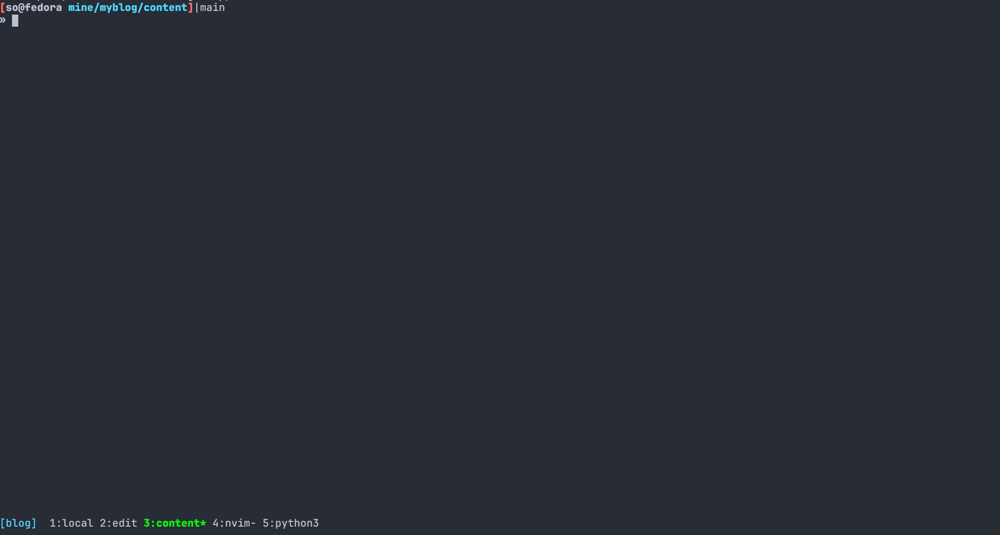
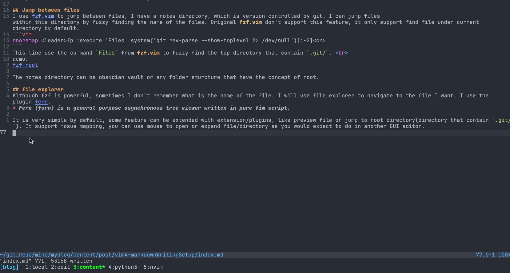
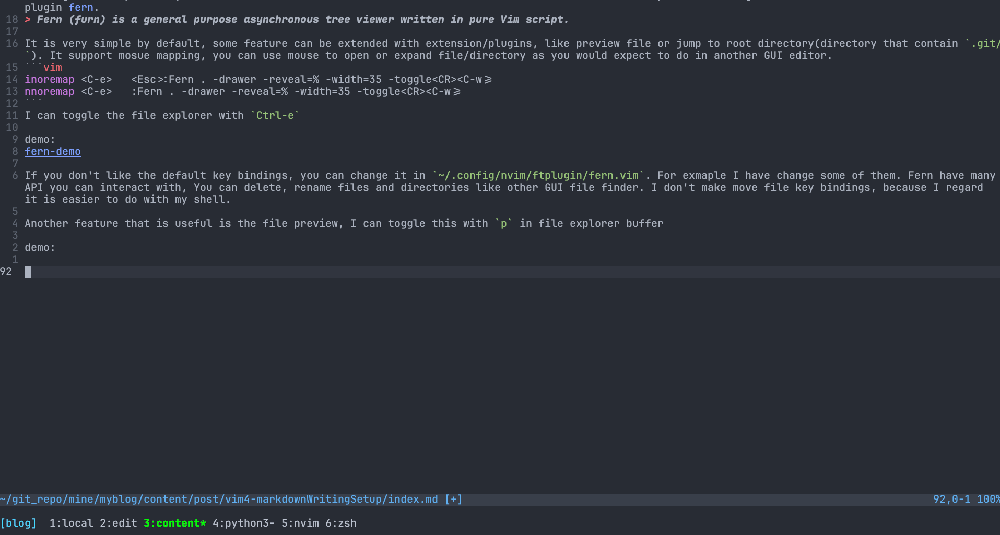
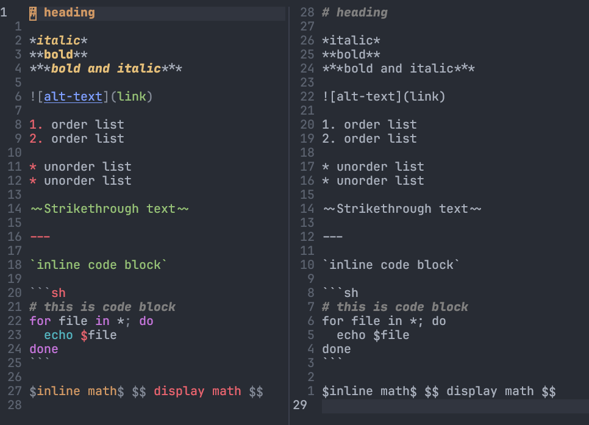
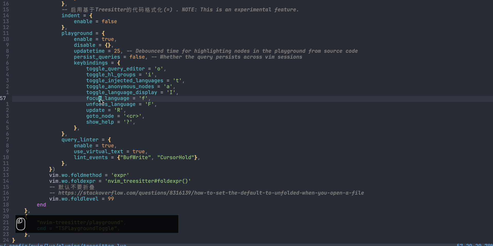
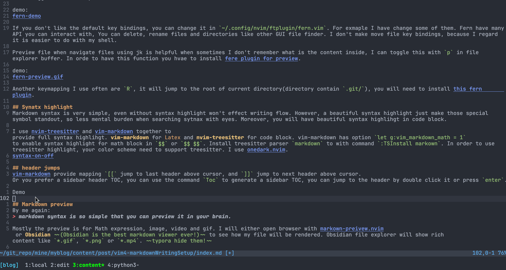
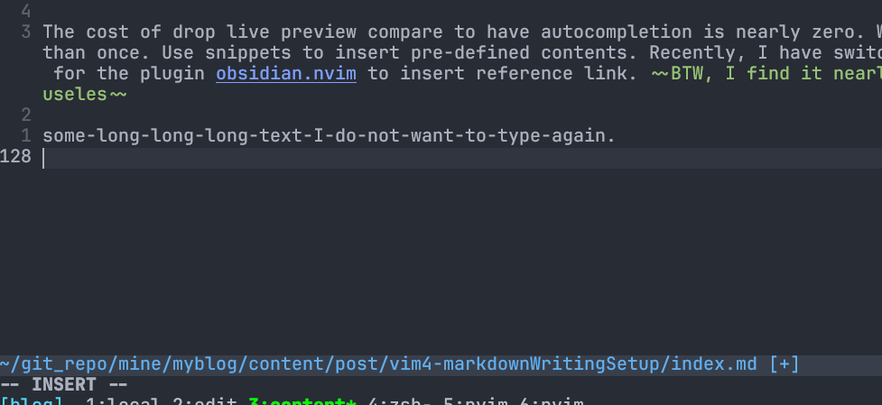
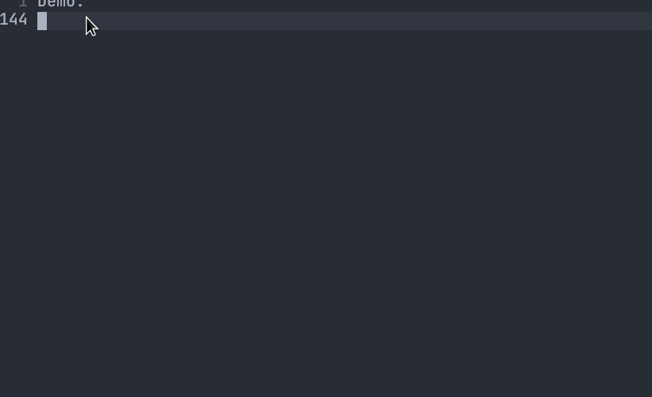

Mainly Introduce Neovim plugins and share config that help markdown writing.

The Full config is [here](https://github.com/sokinpui/dotfiles/tree/main/nvim)

# Before
A good markdown setup just make fun easier, though the most weighted thing in writing should be the content instead of the tools you use. But a right tools will make editing a lot easier. Recently markdown can use for note taking, documenting, or blog writing. Markdown is similiar to HTML, but have a clear and readable syntax. Only looking at the syntax, you can already have idea how the file will be reandered. Compare to Tex, the syntax is simpler but less featured, if you don't need complicate layout of your output file, you should consider markdown first. You can use some simple $Latex$ math expression like `$\int$` in markdown, already well supported by most of markdown editor.

# Choose of editor
Oh, accidently involved to editor war, which editor you prefer? BTW, I use Neovim. There is two type editor, one is designed only for markdown, another are designed for general purpose. In my opinion, most of markdown editor, like **Typora**, or note editor but can also use as a markdown editor like **Obsidian** or **logseq**, former provides good reading and editing experience by its **What You see Is What You GET**(WYSIWYG). Latter provides reference link/backlink feature. Both of them are great, nevertheless, as I have mentioned, markdown as a markup language, its syntax is so simple, a good live preview is quite useless. Backlink is useful, but only useful if you take notes, or try to manage your personal knowledge in another new way. I would still prefer a tree organization for my notes, as most of the knowledge I need is well organizated already. Referencing maybe helpful for writer who need brain storming or system like wiki, it is still hard to imagine who have the mental power to manage and navigate a complex inter-referencing system.

Most of the GUI markdown editor in terms of editing has not difference compare to the default "Text Edit" application of your OS. They may provide some mardkwon syntax allowing you click to insert via mouse, as mentioned above, markdown syntax is so simple that anyone can learn it in one minutes, remember after using a few times. Insert with markdown syntax with mouse is, um ... quite useless, I would say. In terms of editing, I think a general purpose editor may do a better job. Those "general purpose editor" have another name, code editor, I think any of VSCode, Emacs, Atom or Vim should be better in terms of editing, as they have so many features are for edit text! So pick whatever code editor you like! It is so personal choice, hard to recommend one. Hope this article can provide some idea that also works on yours. 

Some features should have for comfortable markdown editing:
1. Jump between files
2. Searching
3. File explorer
4. syntax highlighting
With above items, a comfortable writing environment have done half!

# Setup with Neovim
Install those plugins with the manager you prefer. Since those plugins have more than markdown writing, The key mapping and functionality of them are not fully covered here, please check those plugins' website to have more details.


Using [lavy.nvim](https://github.com/folke/lazy.nvim), we first add those line to init.lua:
```lua
---lazy.nvim
---install plugin if missed
local lazypath = vim.fn.stdpath("data") .. "/lazy/lazy.nvim"
if not vim.loop.fs_stat(lazypath) then
  vim.fn.system({
    "git",
    "clone",
    "--filter=blob:none",
    "https://github.com/folke/lazy.nvim.git",
    "--branch=stable", -- latest stable release
    lazypath,
  })
end

vim.opt.rtp:prepend(lazypath)
-- change you leader key here.
vim.g.mapleader = " "
```
Lazy.nvim recommend you modualize your configuration, make use of `lua/` directory in your vim runtimepath.
```sh
[so@fedora .config/nvim/lua]|lua
» pwd
/home/so/.config/nvim/lua
[so@fedora .config/nvim/lua]|lua
» tree
.
├── config
│   └── lualine.lua
├── lazy-init.lua
├── plugins
│   ├── appearance.lua
│   ├── autocompletion.lua
│   ├── cleverf.lua
│   ├── fern.lua
│   ├── fzf.lua
│   ├── lsp.lua
│   ├── markdown.lua
│   ├── multi_cursor.lua
│   ├── nerdfont.lua
│   ├── pairs.lua
│   ├── sandwich.lua
│   └── treesitter.lua
└── settings
    ├── appearance.lua
    ├── format.lua
    ├── mapping.lua
    └── setting.lua

4 directories, 18 files
```
All the plugins config located at `plugins`, here is how you can load plugin with lazy.nvim in `init.lua`.
```lua
require("lazy").setup({
    require("plugins.nerdfont"),
    require("plugins.appearance"),
    require("plugins.treesitter"),
    require("plugins.cleverf"),
    require("plugins.lsp"),
    require("plugins.sandwich"),
    require("plugins.multi_cursor"),
    require("plugins.pairs"),
    require("plugins.autocompletion"),
    require("plugins.fzf"),
    require("plugins.markdown"),
    require("plugins.fern"),
    { 
        "dstein64/vim-startuptime",
        cmd = "StartupTime",
    },
},{})
```

```lua
-- ~/.config/nvim/lua/plugins/neoconf.lua
return {
    { "folke/neoconf.nvim", cmd = "Neoconf" },
    "folke/neodev.nvim",
}

-- ~/.config/nvim/lua/plugins/cleverf.lua
return {
    {
        "rhysd/clever-f.vim",
        keys = { "f", "F", "t", "T" },
        init = function()
            vim.g.clever_f_smart_case = 1
            vim.g.clever_f_across_no_line = 0
            vim.g.clever_f_chars_match_any_signs = '\t'
            vim.g.clever_f_repeat_last_char_inputs = { '\r' }
            vim.g.clever_f_fix_key_direction = 1
        end,
    },
}

-- ~/.config/nvim/lua/plugins/fern.lua
return {
    {
        'lambdalisue/fern.vim',
        keys = 
        dependencies = {
            {
                'lambdalisue/fern-hijack.vim',
            },
            {
                "lambdalisue/fern-mapping-project-top.vim",
            },
            {
                "sokinpui/my-fern-preview.vim",    
            },
        },
        config = function()
            -- Set the Fern plugin configuration options in Lua
            vim.g["fern#mark_symbol"] = '●'
            vim.g["fern#renderer#default#collapsed_symbol"] = '▷ '
            vim.g["fern#renderer#default#expanded_symbol"] = '▼ '
            vim.g["fern#renderer#default#leading"] = ' '
            vim.g["fern#renderer#default#leaf_symbol"] = ' '
            vim.g["fern#renderer#default#root_symbol"] = '~ '
            vim.g["fern#disable_default_mappings"] = 1
            vim.g["fern#disable_drawer_auto_quit"] = 0
            vim.g["fern#disable_viewer_hide_cursor"] = 1

            -- Define the key mappings
            vim.api.nvim_set_keymap('i', '<C-e>', '<Esc>:Fern . -drawer -reveal=% -width=35 -toggle<CR><C-w>=', { noremap = true, silent = true })
            vim.api.nvim_set_keymap('n', '<C-e>', ':Fern . -drawer -reveal=% -width=35 -toggle<CR><C-w>=', { noremap = true, silent = true })
        end,
    },
}
```
`init` will load when vim startup. <br>
`config` function will load when the plugin is loaded. <br>
plugins in `dependencies` are always lazy-loaded unless the main plugins is loaded. <br>
The benefit os using lazy.nvim is you can lazy load plugins on key, autocmd event, command, filetype. The startup time will be shorter. But most of the time I won't open and close vim oftenly, If I need to run command in shell, I will open a new tmux window, I think it is a good pratice, I would recommend you do so. The reduce of StartupTime is in 10-20 ms in my case compare to using **vim-plug**, really small improvement. But since it is configurate in lua, most of the plugins I recently used provide lua configuration by default, so **lazy.nvim** is convenient a little bit. I don't need to split plugin installation and configuation in two files as used to be in **vim-plug**.


## Jump between files
I use [fzf.vim](https://github.com/junegunn/fzf.vim) to jump between files, I have a notes directory, which is version controlled by git. I can jump files within this directory by fuzzy finding the name of the files. Original **fzf.vim** don't support this feature, it only support find file under current directory by default.
```vim
nnoremap <leader>fp :execute 'Files' system('git rev-parse --show-toplevel 2> /dev/null')[:-2]<cr>
```
This line use the command `Files` from **fzf.vim** to fuzzy find the top directory that contain `.git/`. <br>
demo:


The notes directory can be obsidian vault or any folder sturcture that have the concept of root.


```lua
return {
    {
        'junegunn/fzf.vim',
        dependencies = {
            'junegunn/fzf',
        },
        keys = {
            {"<leader>f"},
            {"<leader>gp"},
            { "<c-l>", mode = "i" },
            { "<c-f>", mode = "i" },
        },
        cmd = {
            "Files",
            "GFiles",
            "Buffers",
            "Colors",
            "Ag",
            "Rg",
            "RG",
            "Lines",
            "BLines",
            "Tags",
            "BTags",
            "Marks",
            "Jumps",
            "Windows",
            "Locate",
            "History",
            "Snippets",
            "Commits",
            "BCommits",
            "Commands",
            "Maps",
            "Helptags",
            "Filetypes",
        },
        build = "./install --all",
        config = function()
            vim.cmd([[
            let g:fzf_preview_window = [ 'right,50%', 'ctrl-/' ]
            let g:fzf_layout         = {'window': { 'width': 0.9, 'height': 1 }}
            let g:fzf_buffers_jump   = 1
            nnoremap <leader>ff :Files<cr>
            nnoremap <leader>fa :Files $HOME<cr>
            nnoremap <leader>fp :<cr>
            nnoremap <leader>fp :execute 'Files' system('git rev-parse --show-toplevel 2> /dev/null')[:-2]<cr>

            nnoremap <leader>fb :Buffers<cr>
            nnoremap <leader>fs :Lines<cr>

            nnoremap <leader>gp :Rg<cr>

            nnoremap <leader>f. :History<cr>
            nnoremap <leader>f/ :History/<cr>
            nnoremap <leader>f: :History:<cr>

            nnoremap <leader>fh :Helptags<cr>
            nnoremap <leader>fc :Commands<cr>

            "insert relative path of file in project
            inoremap <expr> <C-l> fzf#vim#complete#path('fd --type=file . $(git rev-parse --show-cdup 2> /dev/null)')
            inoremap <expr> <C-f> fzf#vim#complete#path('fd --type=file . $(git rev-parse --show-toplevel 2> /dev/null)')
            ]])
        end,
    },
}
```
Make sure you have [fzf](https://github.com/junegunn/fzf) installed with **lazy.nvim**. `cmd` and `keys` are lazy loading config, but I find it really useless, as I have say that I rarely open and close vim in very shorttime, I don't care too much StartupTime, those line config are just for fun, when I switch from **vim-plug** to **lazy.nvim**.
```vim
inoremap <expr> <C-l> fzf#vim#complete#path('fd --type=file . $(git rev-parse --show-cdup 2> /dev/null)')
inoremap <expr> <C-f> fzf#vim#complete#path('fd --type=file . $(git rev-parse --show-toplevel 2> /dev/null)')

```
This first line will insert relative path to file within the root directory that contain `.git/`.

This first line will insert full path to file within the root directory that contain `.git/`.

I recently use this short vimscript snippets instead of the autocompletion obsidian reference link provided by **obsidian.nvim**, see [autocompletion in markdown with vim](#Autocompletion)



## file explorer
Although fzf is powerful, sometimes I don't remember what is the name of the file. I will use file explorer to navigate to the file I want. I use the plugin [fern](https://github.com/lambdalisue/fern.vim).
> Fern (furn) is a general purpose asynchronous tree viewer written in pure Vim script.

It is very simple by default, some feature can be extended with extension/plugins, like preview file or jump to root directory(directory that contain `.git/`). It support mosue mapping, you can use mouse to open or expand file/directory as you would expect to do in another GUI editor.
```vim
inoremap <C-e>   <Esc>:Fern . -drawer -reveal=% -width=35 -toggle<CR><C-w>=
nnoremap <C-e>   :Fern . -drawer -reveal=% -width=35 -toggle<CR><C-w>=
```
I can toggle the file explorer with `Ctrl-e`

demo:


If you don't like the default key bindings, you can change it in `~/.config/nvim/ftplugin/fern.vim`. For exmaple I have change some of them. Fern have many API you can interact with, You can delete, rename files and directories like other GUI file finder. I don't make move file key bindings, because I regard it is easier to do with my shell.

Preview file when navigate files using jk is helpful when sometimes I don't remember what is the content inside, I can toggle this with `p` in file explorer buffer. In orde to have this function you hvae to install [fere plugin for preview](https://github.com/yuki-yano/fern-preview.vim).

demo:


Another keymapping I use often are `R`, it will jump to the root of current directory(directory contain `.git/`), you will need to install [this fern plugin](https://github.com/lambdalisue/fern-mapping-project-top.vim).


```lua
-- ~/.config/nvim/lua/plugins/fern.lua
return {
    {
        'lambdalisue/fern.vim',
        dependencies = {
            {
                'lambdalisue/fern-hijack.vim',
            },
            {
                "lambdalisue/fern-mapping-project-top.vim",
            },
            {
                "sokinpui/my-fern-preview.vim",    
            },
        },
        config = function()
            -- Set the Fern plugin configuration options in Lua
            vim.g["fern#mark_symbol"] = '●'
            vim.g["fern#renderer#default#collapsed_symbol"] = '▷ '
            vim.g["fern#renderer#default#expanded_symbol"] = '▼ '
            vim.g["fern#renderer#default#leading"] = ' '
            vim.g["fern#renderer#default#leaf_symbol"] = ' '
            vim.g["fern#renderer#default#root_symbol"] = '~ '
            vim.g["fern#disable_default_mappings"] = 1
            vim.g["fern#disable_drawer_auto_quit"] = 0
            vim.g["fern#disable_viewer_hide_cursor"] = 1

            -- Define the key mappings
            vim.api.nvim_set_keymap('i', '<C-e>', '<Esc>:Fern . -drawer -reveal=% -width=35 -toggle<CR><C-w>=', { noremap = true, silent = true })
            vim.api.nvim_set_keymap('n', '<C-e>', ':Fern . -drawer -reveal=% -width=35 -toggle<CR><C-w>=', { noremap = true, silent = true })
        end,
    },
}
```
The above snippet install the plugins and change the symbol for displying in directory tree

```vim
" ~/.config/nvim/ftplugin/fern.vim
nmap <buffer><expr>
            \ <Plug>(fern-my-open-expand-collapse)
            \ fern#smart#leaf(
            \   "\<Plug>(fern-action-open:select)",
            \   "\<Plug>(fern-action-expand)",
            \   "\<Plug>(fern-action-collapse)",
            \ )

nmap <buffer> <Plug>(fern-new-and-edit)
      \ <Plug>(fern-action-new-file)
      \ <Plug>(fern-action-open:select)

nnoremap <buffer> <CR> <Plug>(fern-my-open-expand-collapse)
nnoremap <buffer> <TAB> <Plug>(fern-my-open-expand-collapse)
"nnoremap <buffer> h <Plug>(fern-action-collapse)
"nnoremap <buffer> l <Plug>(fern-action-expand)
nnoremap <buffer> <2-LeftMouse> <Plug>(fern-my-open-expand-collapse)

nnoremap <buffer> o <Plug>(fern-new-and-edit)
nnoremap <buffer> nd <Plug>(fern-action-new-dir)
nnoremap <buffer> D <Plug>(fern-action-remove)
nnoremap <buffer> rn <Plug>(fern-action-rename)l

nnoremap <buffer> s <Plug>(fern-action-open:split)
nnoremap <buffer> v <Plug>(fern-action-open:vsplit)
"nnoremap <buffer> r <Plug>(fern-action-reload)
nnoremap <buffer> <nowait> d <Plug>(fern-action-hidden:toggle)
nnoremap <buffer> <nowait> h <Plug>(fern-action-leave)
nnoremap <buffer> <nowait> l <Plug>(fern-action-enter)

"enter project root, contain .git
nnoremap <buffer> R <Plug>(fern-action-project-top)

" preview file
nnoremap <silent> <buffer> p <Plug>(fern-action-preview:auto:toggle)
nnoremap <silent> <buffer> <C-d> <Plug>(fern-action-preview:scroll:down:half)
nnoremap <silent> <buffer> <C-u> <Plug>(fern-action-preview:scroll:up:half)

"smart [q]uit
nnoremap <silent> <buffer> <expr> <Plug>(fern-quit-or-close-preview) fern_preview#smart_preview("\<Plug>(fern-action-preview:close)", ":q\<CR>")
nnoremap <silent> <buffer> q <Plug>(fern-quit-or-close-preview)

setlocal norelativenumber
setlocal nonumber
```
The above snippets change the keymap in fern file explorer buffer. <br>
`<cr>`, doubel-click, and `tab` will expand the directory or open the file. 

`o` will creat new file

`nd` will create new directory

`D` will delete file or directory

`rn` will rename the file or directory

`s` will open file in split horizontial vim window

`v` will open file in split vertical vim window

`d` will show toggle hidden file

`h` will navigate directory one level up at the directory cursor at

`l` will navigate directory one level down at the directory cursor at

`R` will navigate to the root of current directory( contain `.git/` ), you need to install [this plugin](https://github.com/lambdalisue/fern-mapping-project-top.vim)

`p` will toggle file preview, recently rich contents seems to be out of support.

`<c-u>` and `<c-d>` scroll the preview file up and down respectively.

`q` will close fern buffer or close the preview float window.



## Synatx highlight
Markdown syntax is very simple, even without syntax highlight won't effect writing flow. However, a beautiful syntax highlight just make those special symbol standout, so less mental burden when searching sytnax with eyes. Moreover, you will have beautiful syntax highlihgt in code block.

I use [nvim-treesitter](https://github.com/nvim-treesitter/nvim-treesitter) and [vim-markdown](https://github.com/preservim/vim-markdown) together to provide full syntax highlihgt. **vim-markdown** for $Latex$ and **nvim-treesitter** for code block. vim-markdown has option
```vim
let g:vim_markdown_math = 1
```
to enable syntax highlight for math block in `$$` or `$$ $$`. Install treesitter parser `markdown` with command `:TSInstall markown`. In order to use treesitter highlight, your color scheme need to support treesitter. I use [onedark.nvim](https://github.com/navarasu/onedark.nvim).



```lua
-- ~/.config/nvim/lua/plugins/treesitter.lua
return {
    {
        "nvim-treesitter/nvim-treesitter",
        build = ":TSUpdate",
        config = function () 
            local configs = require("nvim-treesitter.configs")
            configs.setup({
                -- 安装 language parser
                -- :TSInstallInfo 命令查看支持的语言
                ensure_installed = {
                    "html",
                    "css",
                    "vim",
                    "lua",
                    "javascript",
                    "typescript",
                    "python",
                    "c",
                    "java",
                    "julia",
                    "query",
                    "markdown",
                    --"markdown_inline",
                    "bash",
                },
                -- 启用代码高亮功能
                highlight = {
                    enable = true,
                    --additional_vim_regex_highlighting = false
                    additional_vim_regex_highlighting = { "markdown" },
                },
                -- 启用增量选择
                incremental_selection = {
                    enable = true,
                    keymaps = {
                        --- init_selection = '<TAB>',
                        node_incremental = '<TAB>',
                        node_decremental = '<S-TAB>',
                        --- scope_incremental = '<TAB>',
                    }
                },
                -- 启用基于Treesitter的代码格式化(=) . NOTE: This is an experimental feature.
                indent = {
                    enable = false
                },
                playground = {
                    enable = true,
                    disable = {},
                    updatetime = 25, -- Debounced time for highlighting nodes in the playground from source code
                    persist_queries = false, -- Whether the query persists across vim sessions
                    keybindings = {
                        toggle_query_editor = 'o',
                        toggle_hl_groups = 'i',
                        toggle_injected_languages = 't',
                        toggle_anonymous_nodes = 'a',
                        toggle_language_display = 'I',
                        focus_language = 'f',
                        unfocus_language = 'F',
                        update = 'R',
                        goto_node = '<cr>',
                        show_help = '?',
                    },
                },
                query_linter = {
                    enable = true,
                    use_virtual_text = true,
                    lint_events = {"BufWrite", "CursorHold"},
                },
            })
            vim.wo.foldmethod = 'expr'
            vim.wo.foldexpr = 'nvim_treesitter#foldexpr()'
            -- 默认不要折叠
            -- https://stackoverflow.com/questions/8316139/how-to-set-the-default-to-unfolded-when-you-open-a-file
            vim.wo.foldlevel = 99
        end
    },
    {
        "nvim-treesitter/playground",
        cmd = "TSPlaygroundToggle",
    },
}
```
incremental_selection is increat the selected region in visual mode according to treesitter filetype parser. This config is copied from an chinese article [here](https://zhuanlan.zhihu.com/p/561676059)

demo:




## header jumps
[vim-markdown](https://github.com/preservim/vim-markdown) provide mapping `[[` jump to last header above cursor, and `]]` jump to next header above cursor. Or you prefer a sidebar header TOC, you can use the command `Toc` to generate a sidebar TOC, you can jump to the header by double click it or press `enter`.

Demo:


## Markdown preview
By me again:
> markdown syntax is so simple that you can preview it in your brain. 

Mostly the preview is for Math expression, image, video and gif. I will either open browser with [markown-preivew.nvim](https://github.com/iamcco/markdown-preview.nvim) or **Obsidian** ~~(Obsidian is the best markdown viewer ever!)~~ to see how my file will be rendered. Obsidian file explorer will show rich content like `*.gif`, `*.png` or `*.mp4`. ~~typora hide them!~~

<!--
difference between typora and obsidian file explorer
-->

## Image clipboard insertion
Paste image from image clipboard to current buffer. Before I know this plugin, whenever I need to paste image, I will open **Obsidian**, because I find their is [extension](https://github.com/reorx/obsidian-paste-image-rename) help me. But now I find this plugin, leaving Obsidian merely a markdown reader.



```lua
return {
    { 
        "iamcco/markdown-preview.nvim",
        build = "cd app && npm install",
        ft = "markdown",
        cmd = "MarkdownPreview",
        config = function()
            vim.g.mkdp_auto_close = false
            vim.g.mkdp_open_to_the_world = false
            vim.g.mkdp_open_ip = "127.0.0.1"
            vim.g.mkdp_port = "8888"
            vim.g.mkdp_browser = "chromium-browser"
            vim.g.mkdp_echo_preview_url = true
            vim.g.mkdp_page_title = "${name}"
        end,
    },
    {
        "preservim/vim-markdown",
        ft = "markdown",
        config = function()
            vim.g.vim_markdown_folding_disabled        = 1
            vim.g.vim_markdown_no_default_key_mappings = 0
            vim.g.vim_markdown_conceal_code_blocks     = 0
            vim.g.vim_markdown_math                    = 1
            vim.g.tex_conceal = ""
            vim.g.vim_markdown_conceal = 1
            vim.g.vim_markdown_toc_autofit = 1
            vim.g.vim_markdown_follow_anchor = 0
            vim.g.vim_markdown_toml_frontmatter = 1
            vim.g.vim_markdown_strikethrough = 1
        end,
    },
    {
        "postfen/clipboard-image.nvim",
        keys = {
            { "<leader>i", "<cmd>PasteImg<CR>"},
        },
        config = function()
            require'clipboard-image'.setup {
                -- Default configuration for all filetype
                default = {
                    img_dir = {"%:p:h", "img"}, -- Use table for nested dir (New feature form PR #20)
                    img_name = function ()
                        vim.fn.inputsave()
                        local name = vim.fn.input('Name: ')
                        vim.fn.inputrestore()
                        return name
                    end,
                    affix = "<\n  %s\n>" -- Multi lines affix
                },
                -- You can create configuration for ceartain filetype by creating another field (markdown, in this case)
                -- If you're uncertain what to name your field to, you can run `lua print(vim.bo.filetype)`
                -- Missing options from `markdown` field will be replaced by options from `default` field
                markdown = {
                    img_dir = {"%:p:h", "img"}, -- Use table for nested dir (New feature form PR #20)
                    img_name = function ()
                        vim.fn.inputsave()
                        local name = vim.fn.input('Name: ')
                        vim.fn.inputrestore()
                        return name
                    end,
                    img_handler = function(img)
                        vim.cmd("normal! f[") -- go to [
                        vim.cmd("normal! a" .. img.name) -- append text with image name
                    end,
                    affix = "",
                }
            }
        end
    },
    {
        "lervag/lists.vim",
        ft = "markdown",
        config = function()
            vim.cmd("ListsEnable")
        end
    }
}
```
image-clipboard will insert image from clipboard when if you press `<leader>i` in normal mode,

Those line will prompt the name before paste
```lua
img_name = function ()
    vim.fn.inputsave()
    local name = vim.fn.input('Name: ')
    vim.fn.inputrestore()
    return name
end
```

Those line keep the alt-text same as the image
```lua
img_handler = function(img)
    vim.cmd("normal! f[") -- go to [
    vim.cmd("normal! a" .. img.name) -- append text with image name
end,
```

This line will store the image in the subfolder `img/` at the directory current file at. If `img/` don't exist, it will be created
```lua
img_dir = {"%:p:h", "img"}, -- Use table for nested dir (New feature form PR #20)
```



## Autocompletion 
The main reason I use an code editor for markdown editing even It don't provide live preview.

Worth to mention again:
> markdown syntax is so simple that you can preview it in your brain. 

The cost of drop live preview compare to have autocompletion is nearly zero. With autocompletion, I can be lazy to type, complete the long words occur more than once. Use snippets to insert pre-defined contents. Recently, I have switch from [coc.nvim](https://github.com/neoclide/coc.nvim) to [nvim-cmp](https://github.com/hrsh7th/nvim-cmp) for the plugin [obsidian.nvim](https://github.com/epwalsh/obsidian.nvim) to insert reference link. ~~BTW, I find it nearly useles~~

demo:



```lua
return {
    {
        'SirVer/ultisnips',
        init = function()
            vim.g.UltiSnipsExpandTrigger = "<C-j>"
            vim.g.UltiSnipsJumpForwardTrigger = "<C-j>"
            vim.g.UltiSnipsJumpBackwardTrigger = "<C-k>"
        end
    },
    {
        'hrsh7th/nvim-cmp',
        event = "InsertEnter",
        dependencies = {
            'hrsh7th/cmp-buffer',
            'FelipeLema/cmp-async-path',
            'hrsh7th/cmp-nvim-lsp',
            --'hrsh7th/cmp-cmdline',
            'hrsh7th/cmp-calc',
            'onsails/lspkind-nvim',
            {
                "quangnguyen30192/cmp-nvim-ultisnips",
                config = function()
                    -- optional call to setup (see customization section)
                    require("cmp_nvim_ultisnips").setup{}
                end,
            },
        },
        config = function()
            local t = function(str)
                return vim.api.nvim_replace_termcodes(str, true, true, true)
            end

            local has_words_before = function()
                local line, col = unpack(vim.api.nvim_win_get_cursor(0))
                return col ~= 0 and vim.api.nvim_buf_get_lines(0, line - 1, line, true)[1]:sub(col, col):match("%s") == nil
            end

            local cmp = require 'cmp'
            --local lspkind = require('lspkind')

            cmp.setup {
                snippet = {
                    expand = function(args)
                        vim.fn["UltiSnips#Anon"](args.body)
                    end,
                },
                sources = {
                    {
                        name = 'buffer',
                        keyword_length = 1,
                        option = {
                            keyword_length = 4,
                            keyword_pattern = [[\k\+]],
                            get_bufnrs = function()
                                return vim.api.nvim_list_bufs()
                            end
                        }
                    },
                    { name = 'nvim_lsp' },
                    { name = "ultisnips" },
                    --{ name = 'cmdline' },
                    { name = 'async_path' },
                    { name = 'calc' },
                },
                mapping = cmp.mapping.preset.insert({
                    ['<c-e>'] = cmp.mapping({
                        i = function(fallback)
                            cmp.close()
                            fallback()
                        end
                    }),
                    ["<Tab>"] = cmp.mapping({
                        i = function(fallback)
                            if cmp.visible() then
                                cmp.select_next_item({ behavior = cmp.SelectBehavior.Insert })
                            elseif has_words_before() then
                                cmp.complete()
                            else
                                fallback()
                            end
                        end,
                    }),
                    ["<S-Tab>"] = cmp.mapping({
                        i = function(fallback)
                            if cmp.visible() then
                                cmp.select_prev_item({ behavior = cmp.SelectBehavior.Insert })
                            else
                                fallback()
                            end
                        end,
                    }),
                    ['<C-n>'] = cmp.mapping({
                        c = function()
                            if cmp.visible() then
                                cmp.select_next_item({ behavior = cmp.SelectBehavior.Select })
                            else
                                vim.api.nvim_feedkeys(t('<Down>'), 'n', true)
                            end
                        end,
                        i = function(fallback)
                            if cmp.visible() then
                                cmp.select_next_item({ behavior = cmp.SelectBehavior.Select })
                            else
                                fallback()
                            end
                        end
                    }),
                    ['<C-p>'] = cmp.mapping({
                        c = function()
                            if cmp.visible() then
                                cmp.select_prev_item({ behavior = cmp.SelectBehavior.Select })
                            else
                                vim.api.nvim_feedkeys(t('<Up>'), 'n', true)
                            end
                        end,
                        i = function(fallback)
                            if cmp.visible() then
                                cmp.select_prev_item({ behavior = cmp.SelectBehavior.Select })
                            else
                                fallback()
                            end
                        end
                    }),
                }),
            }
            cmp.setup.cmdline(':', {
                completion = { autocomplete = false },
                sources = cmp.config.sources({
                    { name = 'async_path' }
                }, {
                    { name = 'cmdline' }
                })
            })
        end
    },
}
```
You can interrupt **nvim-cmp** as the front end, it only provide UI, the source for completion is the backend, where you have to install separately, 

complete words occured in buffer, the `get_bufnrs` function allows you complete words from all opened buffers.(by default only complete words from current buffer)
```lua
{
    name = 'buffer',
    keyword_length = 1,
    option = {
        keyword_length = 4,
        keyword_pattern = [[\k\+]],
    get_bufnrs = function()
        return vim.api.nvim_list_bufs()
    end
    }
},
```
The source `calc` can handle some simple math calculation.

`async_path` will complete directory asynchronous, so won't cause lag when the size of directory is too big.

`<Tab>` and `<S-Tab>` will complete words on suggest menu, You don't have to press `<CR>` to confirm.

`<C-j>` will expand snippets and jump to next snippets cursor holder

`<C-k>` will jump to previous snippets cursor holder

`<C-e>` will close the menu



# zsh
Since using neovim in terminal, some shell hack is required to make writing even more comfortable. I don't use Neovim terminal, its color never display same as my original terminal. Instead, I use tmux new window if I needed. I don't do fancy file management with my Neovim file explorer because I prefer to manage them in shell.

The last required configuration of zsh are merely tab completion and remapping the fully sucked tmux default key bindings.

For zsh completion, I would recommend you read [this blog detaily cover about zsh completion](https://thevaluable.dev/zsh-completion-guide-examples/)

For tmux configuration guide, I would recommend you read [this blog detaily cover about configure tmux](https://thevaluable.dev/tmux-config-mouseless/)

# May not helpful
## conceal
Hide the syntax when cursor is not at the line, maybe helpful or not. Vim has this function built-in, you can set `set conceallevel=2`. vim-markdown also have options that control concealment for different group, they are:

`let g:vim_markdown_math = 1` to enalbe concealment for $Latex$ syntax

`let g:tex_conceal = ""` to enalbe concealment for $Latex$ delimiter

`let g:vim_markdown_conceal_code_blocks = 1` to enalbe concealment for code block delimiter.

`let g:vim_markdown_strikethrough = 1` to enable concealment for Strikethrough. *This featuer don't require conceallevel set in vim*


Demo


## Auto list in vim
Since most of the GUI markdown editor support auto generate list when you hit enter. I found one plugin [bullets.vim](https://github.com/dkarter/bullets.vim). It will auto insert list base on the list symbol last line used. Quite helpful when you insert orderlist. But it seems to break your `<CR>` in other plugins, but just fine with me, please see [this discussion on reddit](https://www.reddit.com/r/neovim/comments/nx4s7g/is_there_an_actually_good_numbered_list_plugin/) <br>
Demo:


## Searching
I will open **Obsidian** and use its search box. Sometimes I will open new tmux windows and search with [rg(ripgrep)](https://github.com/BurntSushi/ripgrep)

# After
As you see, the markdown system built in this blog is totally offline, so that you can choose the tools for different task, like A code editor over in editing, a notes taking app over in reading rich content. I do use some cloud based notes app like notion, However, it often lag, and low in protability, the file is difficult to edit outside it. I am forced to use the function provided by single application. I prefer offline solution than cloud based for markdown writing.
