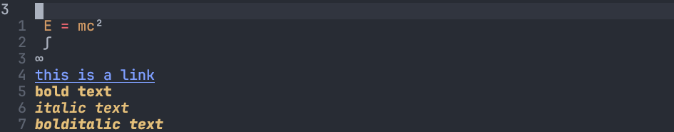

There are so many markdown editor exist already, most of them are really easy to use. But most of them provide feature more close to preview the markdown document, rather than editing or help writing. Like [typora](https://typora.io/), it trust to have to best markdown writing experience as it has great live preview and **What You See Is What You Mean**. I love its **What You See Is What You Mean**, since it must same as how the file render on browser, however, markdown file is so simple compare to tex, what you writing is close enough to what you see. Therefore, I regard [typora](https://typora.io/) as a good markdown reader instead of good markdown writer.

Another application I want to discuss about, [obsidian](https://obsidian.md/), also provide great live preview, it has sidebar file explorer, extension support, making it look like vscode for markdown. However, in terms of markdown editing. obsidian is still far behind an serious editor like emacs, vscode or vim. I don't say obsidian is not good as them, it is the difference between their purpose, "Markdown editor" is just good for reading markdown file, "Editor" is just good at editing. This is the reason I would recommend using an editor as the backend of markdown writing. You don't have to use vim, you can pick your favourite editor. This blog provide ideas to speed up your markdown writing.

# fzf and markdown
## Navigate obsidian vault
It is common that we work on an directory instead of single file, often jump to another file, other than clicking your file explorer, you can use fzf to jump to another file. For example you can map a shortcut that will fzf search the root of your markdown directory. **Obsidian** has the concept of vault, it is same as directory, or git repo, You can convert your obsidian vault to git repo, they won't conflict.

Neovim has many fzf tools integrated well, I use [fzf.vim](https://github.com/junegunn/fzf.vim), because I know it first, there are very little difference between those fzf.vim in terms of functionality, just pick one.

With lines of vimscript, jumping within your vault is easy:
```vim
function! s:fzfroot#find_git_root()
    return system('git rev-parse --show-toplevel 2> /dev/null')[:-2]
endfunction

command! ProjectFiles execute 'Files' fzfroot#find_git_root()
```
You can use command ProjectFiles to naigate your vault after convert it into git repo. You can of course map a key to `ProjectFiles`.

## insert link to files
When writing or note taking, we often link file together, if you care about protabilty, you may not want to use obsidian specific wiki link format, you may prefer markdown format more, so to insert file link within obsidian vault, **fzf.vim** can do so.
```vim
inoremap <expr> <C-l> fzf#vim#complete#path('fd --type=file . $(git rev-parse --show-cdup 2> /dev/null)')
inoremap <expr> <C-f> fzf#vim#complete#path('fd --type=file . $(git rev-parse --show-toplevel 2> /dev/null)')
```
The first line insert relative path to root of vault, the second line will insert full path to the file. you can autocomplete when you editing link `[]()`.

# snips
Snippets is just easier to set up on code editor than markdown editor, and integrate well with auto completion. I use [Ultisnips](https://github.com/SirVer/ultisnips) I have decide merge to Luasnips, but their is only little preformance enhancment, so I stay in Ultisnips. You can check my autocomplete and snippets setup in [this blog](  )  

# Concealment
You can concealment markdown syntax by add the following line in your `vimrc`
```vim
set conceallevel=2
```
Example:

