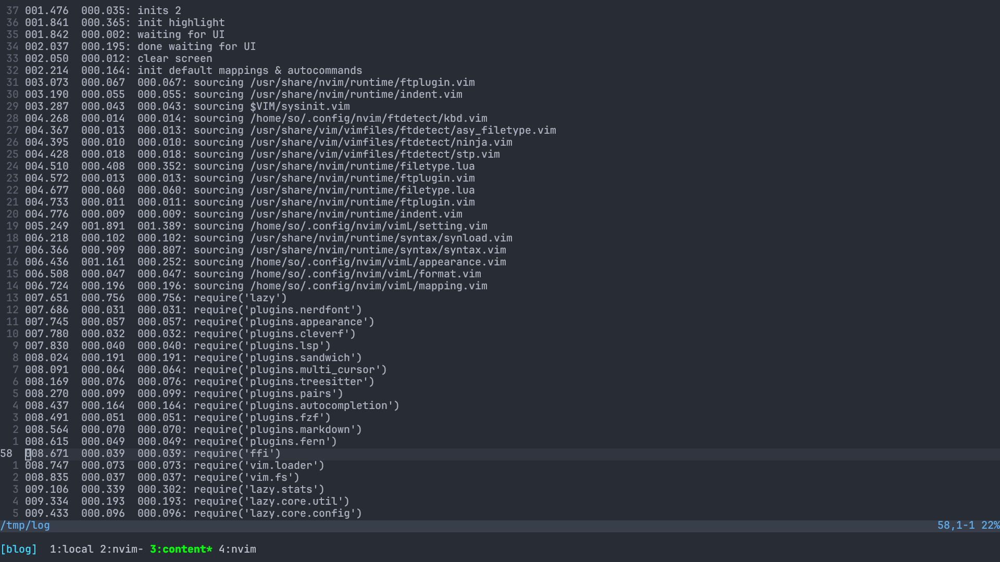
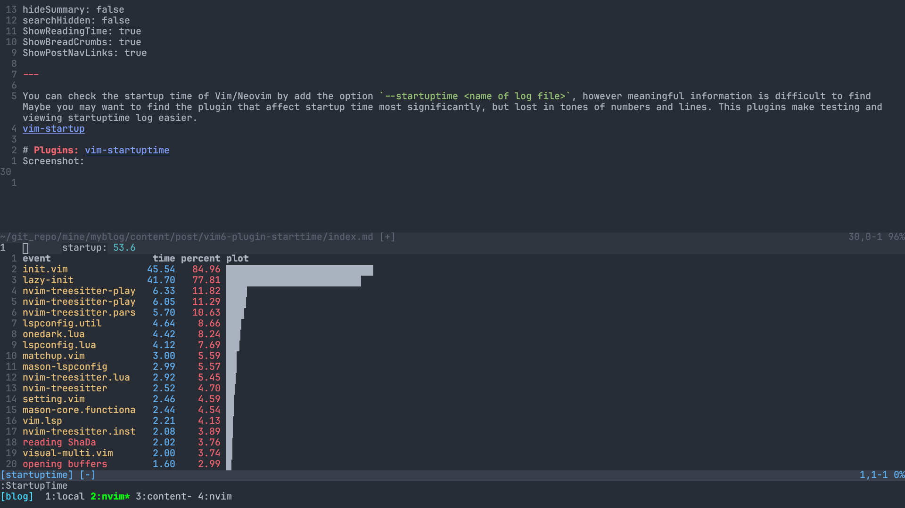

You can check the startup time of Vim/Neovim by add the option `--startuptime <name of log file>`, however meaningful information is difficult to find Maybe you may want to find the plugin that affect startup time most significantly, but lost in tones of numbers and lines. This plugins make testing and viewing startuptime log easier.

# Plugins: [vim-startuptime](https://github.com/dstein64/vim-startuptime)
Screenshot:

This plugins allow you check the startup time afte open Neovim, maybe more intutitive than using option `--startuptime`?

