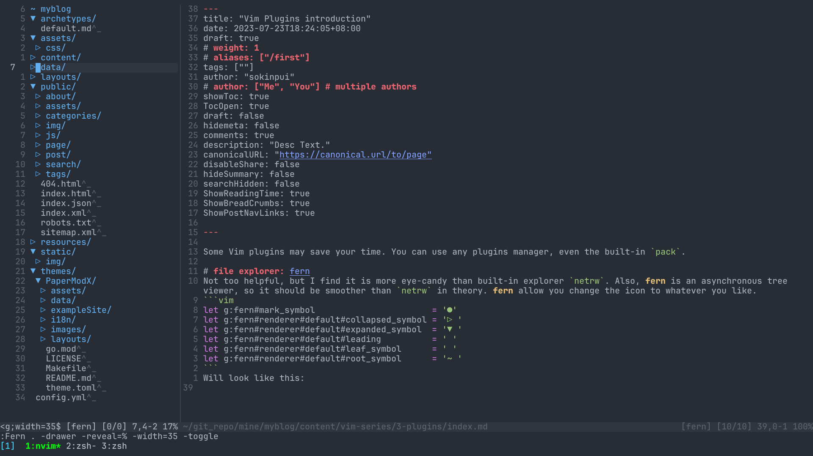
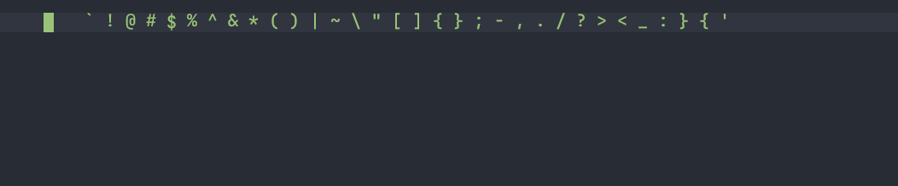
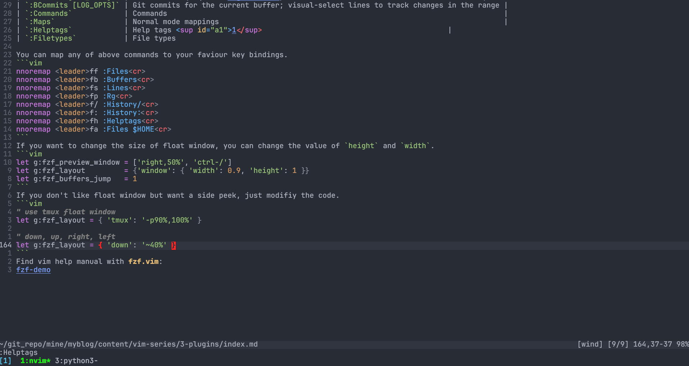

Some Vim plugins may save your time. You can use any plugins manager, even the built-in `pack`.

# File explorer: [fern](https://github.com/lambdalisue/fern.vim)
Not too helpful, but I find it is more eye-candy than built-in explorer `netrw`. Also, **fern** is an asynchronous tree viewer, so it should be smoother than `netrw` in theory. **fern** allow you change the icon to whatever you like.
```vim
let g:fern#mark_symbol                       = '●'
let g:fern#renderer#default#collapsed_symbol = '▷ '
let g:fern#renderer#default#expanded_symbol  = '▼ '
let g:fern#renderer#default#leading          = ' '
let g:fern#renderer#default#leaf_symbol      = ' '
let g:fern#renderer#default#root_symbol      = '~ '
```
Will look like this:


**Fern** have some plugins extend its functionality, like this [fern plugin](https://github.com/lambdalisue/fern-hijack.vim) replace `netrw` when you open directory using vim. [preview file in float window](https://github.com/yuki-yano/fern-preview.vim). [This plugin](https://github.com/lambdalisue/fern-hijack.vim) allow you map key jump to the root of project (by default is ^). You can find more fern plugin [here](https://github.com/topics/fern-vim-plugin)

```vim
nmap <buffer><expr>
            \ <Plug>(fern-my-open-expand-collapse)
            \ fern#smart#leaf(
            \   "\<Plug>(fern-action-open:select)",
            \   "\<Plug>(fern-action-expand)",
            \   "\<Plug>(fern-action-collapse)",
            \ )

nmap <buffer> <Plug>(fern-new-and-edit)
      \ <Plug>(fern-action-new-file)
      \ <Plug>(fern-action-open:select)

nnoremap <buffer> <CR> <Plug>(fern-my-open-expand-collapse)
nnoremap <buffer> <TAB> <Plug>(fern-my-open-expand-collapse)
nnoremap <buffer> h <Plug>(fern-action-collapse)
nnoremap <buffer> l <Plug>(fern-action-expand)
nnoremap <buffer> <2-LeftMouse> <Plug>(fern-my-open-expand-collapse)

nnoremap <buffer> o <Plug>(fern-new-and-edit)
nnoremap <buffer> nd <Plug>(fern-action-new-dir)
nnoremap <buffer> D <Plug>(fern-action-remove)
nnoremap <buffer> rn <Plug>(fern-action-rename)l

nnoremap <buffer> s <Plug>(fern-action-open:split)
nnoremap <buffer> v <Plug>(fern-action-open:vsplit)
nnoremap <buffer> r <Plug>(fern-action-reload)
nnoremap <buffer> <nowait> . <Plug>(fern-action-hidden:toggle)
nnoremap <buffer> <nowait> < <Plug>(fern-action-leave)
nnoremap <buffer> <nowait> > <Plug>(fern-action-enter)

"enter project root, find the toppest directory contain .git
nnoremap <buffer> ^ <Plug>(fern-action-project-top)

" preview file
"nnoremap <silent> <buffer> p     <Plug>(fern-action-preview:toggle)
nnoremap <silent> <buffer> <C-p> <Plug>(fern-action-preview:auto:toggle)
nnoremap <silent> <buffer> <C-d> <Plug>(fern-action-preview:scroll:down:half)
nnoremap <silent> <buffer> <C-u> <Plug>(fern-action-preview:scroll:up:half)

"smart [q]uit
nnoremap <silent> <buffer> <expr> <Plug>(fern-quit-or-close-preview) fern_preview#smart_preview("\<Plug>(fern-action-preview:close)", ":q\<CR>")
nnoremap <silent> <buffer> q <Plug>(fern-quit-or-close-preview)
```

# Horizontal motion: [clever-f](https://github.com/rhysd/clever-f.vim)
**clever-f** extend the Vim's f, F, t and T function, you can press `f` to jump instead `;`, similarly, use `F` to jump backward like `,`. **clever-f** allow you jump multi lines by default, super convenient when `dfn` cross line.

Since many symbol ({, (, ", and so on) keys are hard to press. **clever-f** by default map f; to match any symbol, super clever!. *(I map to <TAB>)*

```vim
let g:clever_f_smart_case              = 1
let g:clever_f_across_no_line          = 0
let g:clever_f_chars_match_any_signs   = "\<TAB>"
let g:clever_f_repeat_last_char_inputs = [ "\<CR>" ]
```

# multi cursor: [vim-visual-multi](https://github.com/mg979/vim-visual-multi)
**vim-visual-multi** bring this common feature from others editor to Vim. Sometimes it is convenient and more intuitive than `:s/pattern/changes/<opt>` or visual block mode.

Use a, A, i, O, to insert text like in Vim normal mode. Use x to delete selection. Use r to replace all text in selection like r in Vim visual mode. Press n/N to get next/previous occurrence. Press q to skip current and get next occurrence. Press Q to remove current cursor/selection.

By default, it start multi cursor by pressing `<C-n>`.(I map it to `<leader>n`) The most exciting of this plugins is, it has integrated with auto-completion like [coc.nvim](https://github.com/neoclide/coc.nvim)!


# fzf x vim: [fzf.vim](https://github.com/junegunn/fzf.vim)
**fzf.vim** is the comand line tools [fzf](https://github.com/junegunn/fzf) wrapper for vim. Fuzzy finder result will display in Vim float windows. Powerful tools to jumps and navigate project and files within Vim.
From official website, **fzf.vim** can fuzzy find all of them:

| Command                | List                                                                                  |
| ---                    | ---                                                                                   |
| `:Files [PATH]`        | Files (runs `$FZF_DEFAULT_COMMAND` if defined)                                        |
| `:GFiles [OPTS]`       | Git files (`git ls-files`)                                                            |
| `:GFiles?`             | Git files (`git status`)                                                              |
| `:Buffers`             | Open buffers                                                                          |
| `:Colors`              | Color schemes                                                                         |
| `:Ag [PATTERN]`        | [ag][ag] search result (`ALT-A` to select all, `ALT-D` to deselect all)               |
| `:Rg [PATTERN]`        | [rg][rg] search result (`ALT-A` to select all, `ALT-D` to deselect all)               |
| `:RG [PATTERN]`        | [rg][rg] search result; relaunch ripgrep on every keystroke                           |
| `:Lines [QUERY]`       | Lines in loaded buffers                                                               |
| `:BLines [QUERY]`      | Lines in the current buffer                                                           |
| `:Tags [QUERY]`        | Tags in the project (`ctags -R`)                                                      |
| `:BTags [QUERY]`       | Tags in the current buffer                                                            |
| `:Marks`               | Marks                                                                                 |
| `:Jumps`               | Jumps                                                                                 |
| `:Windows`             | Windows                                                                               |
| `:Locate PATTERN`      | `locate` command output                                                               |
| `:History`             | `v:oldfiles` and open buffers                                                         |
| `:History:`            | Command history                                                                       |
| `:History/`            | Search history                                                                        |
| `:Snippets`            | Snippets ([UltiSnips][us])                                                            |
| `:Commits [LOG_OPTS]`  | Git commits (requires [fugitive.vim][f])                                              |
| `:BCommits [LOG_OPTS]` | Git commits for the current buffer; visual-select lines to track changes in the range |
| `:Commands`            | Commands                                                                              |
| `:Maps`                | Normal mode mappings                                                                  |
| `:Helptags`            | Help tags <sup id="a1">[1](#helptags)</sup>                                           |
| `:Filetypes`           | File types

You can map any of above commands to your faviour key bindings.
```vim
nnoremap <leader>ff :Files<cr>
nnoremap <leader>fb :Buffers<cr>
nnoremap <leader>fs :Lines<cr>
nnoremap <leader>fp :Rg<cr>
nnoremap <leader>f/ :History/<cr>
nnoremap <leader>f: :History:<cr>
nnoremap <leader>fh :Helptags<cr>
nnoremap <leader>fa :Files $HOME<cr>
```
If you want to change the size of float window, you can change the value of `height` and `width`. 
```vim
let g:fzf_preview_window = ['right,50%', 'ctrl-/']
let g:fzf_layout         = {'window': { 'width': 0.9, 'height': 1 }}
let g:fzf_buffers_jump   = 1
```
If you don't like float window but want a side peek, just modifiy the code.
```vim
" use tmux float window
let g:fzf_layout = { 'tmux': '-p90%,100%' }

" down, up, right, left
let g:fzf_layout = { 'down': '~40%' }
```
Find vim help manual with **fzf.vim**:

