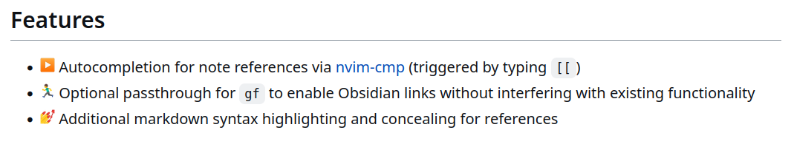
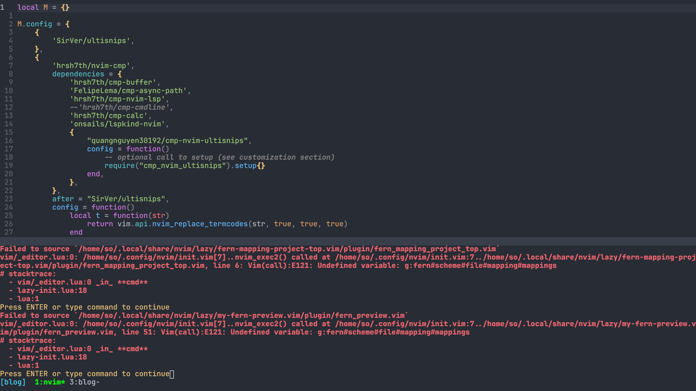
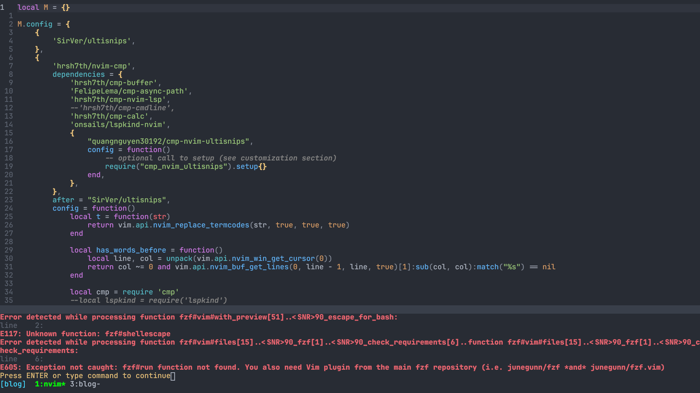
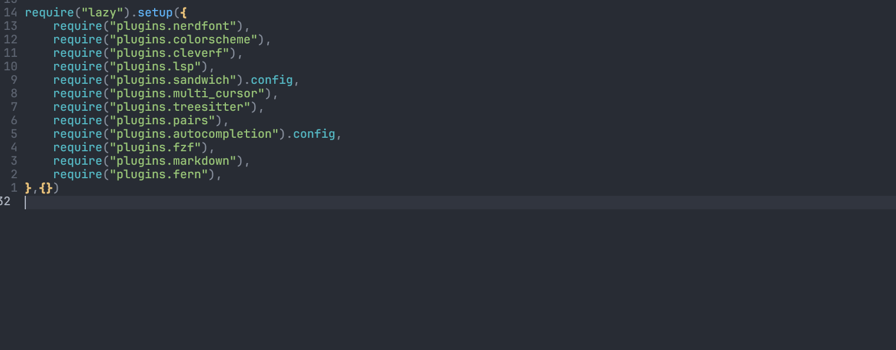
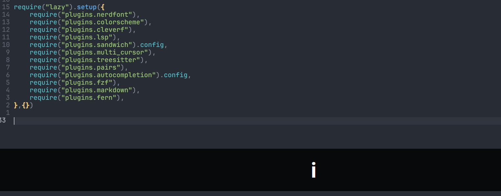

Tips and issue I discovered during mergation. Hope to save someone's time in the future.

# Why lazy.nvim
This is a long story, shall we start from another application [obsidian](https://obsidian.md/). I use **obsidian** for notes taking. I want some faster, non-repeative and easier note editing tools, and therefor I use some editor as my obsidian editing engine, in my case, Neovim Setup autocompletion and snippets in Neovim is always easier than same setup on obsidian. In Neovim, we have [coc.nvim](https://github.com/neoclide/coc.nvim), [nvim-cmp](https://github.com/hrsh7th/nvim-cmp) and [coq_nvim](https://github.com/ms-jpq/coq_nvim) etc... And you have many snippets source. However, I cannot easily insert link to files as well as link to header in Vim. Although coc.nvim already provide some [source](https://github.com/neoclide/coc.nvim/wiki/Completion-with-sources#completion-sources), lacking obsidian. Then I google for solution, I found [obsidian.nvim](https://github.com/epwalsh/obsidian.nvim), which say it provide link completion source for **nvim-cmp** 


Then I have look at nvim-cmp, It separate autocompletion front end and back end, user have too integrate them manually. In terms of personalization, it provide more free. It terms of out-of-box, it is bad. If only insert link to relative file, [fzf.vim](https://github.com/junegunn/fzf.vim) with some tweaks can do so.
```vim
"find the root git repo, in case of obsidian, it is the vault

" insert relative path
inoremap <expr> <C-l> fzf#vim#complete#path('fd --type=file .
    \ $(git rev-parse --show-cdup 2> /dev/null)')

" insert full path
inoremap <expr> <C-f> fzf#vim#complete#path('fd --type=file .
    \ $(git rev-parse --show-toplevel 2> /dev/null)')
```
But too much tweaks for insert header as smooth as obsidian.

So, I try nvim-cmp, I just find that many of Neovim specify plugins have to configurate in lua, it should be easier to manage those plugin with some Neovim plugin manager like [lavy.nvim](https://github.com/folke/lazy.nvim). (Many lua plugins provide snippets for installation and configuration at the same place, but require lazy.nvim or packer.nvim) Then, this is the beginning of this blog.

# issue
can't use pack anymore
require dependency if this is some plugins of plugins.

Lazy.nvim will and need to manage all your plugin, see the description from **lazy.nvim**
> lazy.nvim does NOT use Neovim packages and even disables plugin loading completely (vim.go.loadplugins = false). It takes over the complete startup sequence for more flexibility and better performance.
> In practice this means that step 10 of Neovim Initialization is done by Lazy:
>
>    All the plugins' init() functions are executed
>    All plugins with lazy=false are loaded. This includes sourcing /plugin and /ftdetect files. (/after will not be sourced yet)
>    All files from /plugin and /ftdetect directories in you rtp are sourced (excluding /after)
>    All /after/plugin files are sourced (this includes /after from plugins)
>
> Files from runtime directories are always sourced in alphabetical order.
So all the plugins installed with vim built-in plugins will not be loaded, or you have to add extra options when you calling:
```lua
return {
  {dir='~/config/nvim/pack/*/start/Plugin', config=true},
}
```
when return the plugin table spec to **lazy.nvim**, if you use pack directory to manage personal scirpt or plugins like me, you have to consider move those plugins into your `$NVIMRUNTIMPATH` `~/.confg/nvim`. I merge them with simple bash script:
```
moveToRtp(){
  for plugindir in $*; do
    cd $plugindir
    for file in $(find . -type f)
      rtp=$(echo $(echo $file | sed "s/\.\///") | sed "s/\/.*$//")
      cp file "~/.config/nvim/$rtp"
    cd ..
}

moveToRtp Plugin1 Plugin2 Plugin3 ...
```
This simple script will can move plugins don't contain `/after/*`. I just `/after/*` manually.

# plugins need to take extra care durig mergation
Some plugins configuration need special care when configure with **lazy.nvim**. Most of the case I found related to plugins' compability with *lua*, I would recommend if the confiuration is already in vimscript, keep going with vimscript if you don't care performance loss(actually I don't know how much loss, maybe it is ignorable)
```lua
return {
    "some/plugin",
    config = function()
        vim.cmd([[
            let g:plguinSettings = "..."
            noremap <C-j> <Plug>(plugin-do-something)
        ]])
    end
}
```
It should solve most of the problem and save time during mergation because you can avoid rewrite all configuration in lua when vim plugins usually provide vimscript api for configuration. Due to the difference between data structure of vimscript and lua, `vim.g.setttingAPI = "..."` may not always work.

## 1. [fern.vim](https://github.com/lambdalisue/fern.vim)
> Fern (furn) is a general purpose asynchronous tree viewer written in pure Vim script.
If you use fern with some [external plugins](https://github.com/lambdalisue/fern.vim/wiki/Plugins), you should remember add them as dependency of **fern.vim**:
```lua
return {
    {
        'lambdalisue/fern.vim',
        dependencies = {
            'lambdalisue/fern-hijack.vim',
            "lambdalisue/fern-mapping-project-top.vim",
            "sokinpui/my-fern-preview.vim",    
        },
}
```
Otherwise, you may see error like:


## 2. [fzf.vim](https://github.com/junegunn/fzf.vim)
If install **fzf.vim** with vim-plug, I don't have to install [fzf](https://github.com/junegunn/fzf) if I have install fzf locally outside vim. However, you should do so in **lazy.nvim**
```lua
return {
    {
        'junegunn/fzf.vim',
        build = "./install --all",
    },
    'junegunn/fzf',
}
```
Otherwise, error again:


## 3. [visual-multi](https://github.com/mg979/vim-visual-multi)
It is a mulit cursor plugin for Vim. If you remap key like me, I remap `s` to `c` in multi-cursor mode. In lua, you should use
```lua
return {
    {
        "mg979/vim-visual-multi",
        branch = "master",
        config = function()
            vim.g.VM_custom_remaps = { s = 'c' }
        end
    },
}
```
instead of `let g:VM_custom_remaps = { 's' = 'c' }` in vimscript.

## 4. [auto-pairs](https://github.com/jiangmiao/auto-pairs)
```lua
return {
    {
        "LunarWatcher/auto-pairs",
        config = function()
            vim.g.AutoPairs = {
                ['('] = ')',
                ['['] = ']',
                ['{'] = '}',
                ['''] = ''',
                ['"'] = '"',
                ['`'] = '`',
                ['<!--'] = '-->',
                ['/*'] = '*/',
                ['```'] = '```',
                ['"""'] = '"""',
                ["'''"] = "'''"
            }
        end,
    },
}
```
Since offical version in vimscript is:
```vim
let g:AutoPairs = {'(':')', '[':']', '{':'}',"'":"'",'"':'"', "`":"`", '<!--':'-->', '/*':'*/', '```':'```', '"""':'"""', "'''":"'''"}
```

## 5. [sandwich-vim](https://github.com/machakann/vim-sandwich)
I don't know why `g:sandwich_no_default_key_mappings` cannnot set via **Lazy.nvim** with lua. I have to do so to take configuration work
```lua
local M = {}

M.config = {
    {
        "machakann/vim-sandwich",
    },
}

vim.cmd([[
let g:sandwich_no_default_key_mappings = 1
" my mapping
...
...
]])

return M
```
and then in `init.lua`, I should call this block with.config
```
require("lazy").setup({
    require("plugins.sandwich").config,
},{})

```

## 6. [Ultisnips](https://github.com/SirVer/ultisnips) x [nvim-cmp](https://github.com/hrsh7th/nvim-cmp)
The `tab` will sucks if you have setting wrong, this part is the most time-consumming part to debug, I nearly give up with nvim-cmp because of its bad properties.

In **Ultisnips**, you can change the key for expand and jump, since I don't like press `<CR>` to confirm completion selection, I use `<C-j>` to expand and jump forward in snips, `<C-k>` to jump backward.

At the beginning, I try follow plugin table spec for nvim-cmp:
```lua
local M = {}

M.config = {
    {
        'SirVer/ultisnips',
    },
    {
        'hrsh7th/nvim-cmp',
        dependencies = {
            'hrsh7th/cmp-buffer',
            'FelipeLema/cmp-async-path',
            'hrsh7th/cmp-nvim-lsp',
            --'hrsh7th/cmp-cmdline',
            'hrsh7th/cmp-calc',
            'onsails/lspkind-nvim',
            {
                "quangnguyen30192/cmp-nvim-ultisnips",
                config = function()
                    -- optional call to setup (see customization section)
                    require("cmp_nvim_ultisnips").setup{}
                end,
            },
        },
        after = "SirVer/ultisnips",

        config = function()

            local has_words_before = function()
                local line, col = unpack(vim.api.nvim_win_get_cursor(0))
                return col ~= 0 and vim.api.nvim_buf_get_lines(0, line - 1, line, true)[1]:sub(col, col):match("%s") == nil
            end

            vim.g.UltiSnipsExpandTrigger = "<C-j>"
            vim.g.UltiSnipsJumpForwardTrigger = "<C-j>"
            vim.g.UltiSnipsJumpBackwardTrigger = "<C-k>"

            local cmp = require 'cmp'
            --local lspkind = require('lspkind')

            cmp.setup {
                snippet = {
                    expand = function(args)
                        vim.fn["UltiSnips#Anon"](args.body)
                    end,
                },
                sources = {
                    {name = 'buffer' , keyword_length = 0},
                    { name = 'nvim_lsp' },
                    { name = "ultisnips" },
                    --{ name = 'cmdline' },
                    { name = 'async_path' },
                    { name = 'calc' },
                },
                mapping = cmp.mapping.preset.insert({
                    ["<Tab>"] = cmp.mapping({
                        i = function(fallback)
                            if cmp.visible() then
                                cmp.select_next_item({ behavior = cmp.SelectBehavior.Insert })
                            elseif has_words_before() then
                                cmp.complete()
                            else
                                fallback()
                            end
                        end,
                    }),
                    ["<S-Tab>"] = cmp.mapping({
                        i = function(fallback)
                            if cmp.visible() then
                                cmp.select_prev_item({ behavior = cmp.SelectBehavior.Insert })
                            else
                                fallback()
                            end
                        end,
                    }),
            }
        end
    },
}

return M
```
Pay attention with this three line
```lua
vim.g.UltiSnipsExpandTrigger = "<C-j>"
vim.g.UltiSnipsJumpForwardTrigger = "<C-j>"
vim.g.UltiSnipsJumpBackwardTrigger = "<C-k>"
```
No matter in lua or in vimscript
```vim
let g:UltiSnipsExpandTrigger = "<C-j>"
let g:UltiSnipsJumpForwardTrigger = "<C-j>"
let g:UltiSnipsJumpBackwardTrigger = "<C-k>"
```
The tab will break, I don't know why, with above three lines, tab will act like:


However, if those three line is out of management of **lazy.nvim**, the tab just work!
```lua
local M = {}

M.config = {
    {
        'SirVer/ultisnips',
    },
    {
        'hrsh7th/nvim-cmp',
        dependencies = {
            'hrsh7th/cmp-buffer',
            'FelipeLema/cmp-async-path',
            'hrsh7th/cmp-nvim-lsp',
            --'hrsh7th/cmp-cmdline',
            'hrsh7th/cmp-calc',
            'onsails/lspkind-nvim',
            {
                "quangnguyen30192/cmp-nvim-ultisnips",
                config = function()
                    -- optional call to setup (see customization section)
                    require("cmp_nvim_ultisnips").setup{}
                end,
            },
        },
        after = "SirVer/ultisnips",

        config = function()

            local has_words_before = function()
                local line, col = unpack(vim.api.nvim_win_get_cursor(0))
                return col ~= 0 and vim.api.nvim_buf_get_lines(0, line - 1, line, true)[1]:sub(col, col):match("%s") == nil
            end

            local cmp = require 'cmp'
            --local lspkind = require('lspkind')

            cmp.setup {
                snippet = {
                    expand = function(args)
                        vim.fn["UltiSnips#Anon"](args.body)
                    end,
                },
                sources = {
                    {name = 'buffer' , keyword_length = 0},
                    { name = 'nvim_lsp' },
                    { name = "ultisnips" },
                    --{ name = 'cmdline' },
                    { name = 'async_path' },
                    { name = 'calc' },
                },
                mapping = cmp.mapping.preset.insert({
                    ["<Tab>"] = cmp.mapping({
                        i = function(fallback)
                            if cmp.visible() then
                                cmp.select_next_item({ behavior = cmp.SelectBehavior.Insert })
                            elseif has_words_before() then
                                cmp.complete()
                            else
                                fallback()
                            end
                        end,
                    }),
                    ["<S-Tab>"] = cmp.mapping({
                        i = function(fallback)
                            if cmp.visible() then
                                cmp.select_prev_item({ behavior = cmp.SelectBehavior.Insert })
                            else
                                fallback()
                            end
                        end,
                    }),
            }
        end
    },
}

vim.g.UltiSnipsExpandTrigger = "<C-j>"
vim.g.UltiSnipsJumpForwardTrigger = "<C-j>"
vim.g.UltiSnipsJumpBackwardTrigger = "<C-k>"

return M
```
Everythin just work!


# benefits
The plugins is more structured, so navigation and group plugins is easier than **vim-plug**, with some **plugin** like **fzf.vim**, I can easily jump to file I want, and separate plugin config into different files according to their purpose. Before using **lazy.nvim** all plugins config are store in the same file call `plugins.vim`, now modualize like:
```sh
├── config
│   └── lualine.lua
├── lazy-init.lua
└── plugins
    ├── autocompletion.lua
    ├── cleverf.lua
    ├── colorscheme.lua
    ├── fern.lua
    ├── fzf.lua
    ├── lsp.lua
    ├── markdown.lua
    ├── multi_cursor.lua
    ├── nerdfont.lua
    ├── pairs.lua
    ├── sandwich.lua
    └── treesitter.lua
```
# Finall thoughts
As most of plugin I used are written for both Vim and Neovim, most of them are still providing vimscript api to config, there are only some little surprise issue from prefect.
